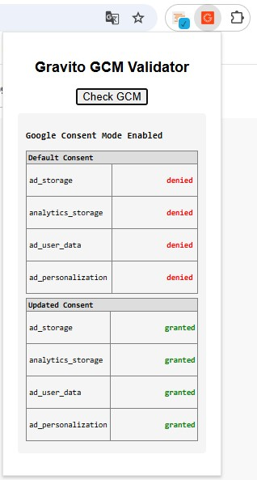

# Consent Management: Google Consent Mode

*Last updated: June 15, 2025*  
*Announced: January 10, 2024*

---

## Overview

Google Consent Mode allows you to adjust how your Google tags behave based on the consent status of your end users. When integrated with **Gravito**’s TCF 2.2 CMP, it helps ensure compliance by dynamically controlling tag behavior across Google products such as Google Analytics, Google Ads, and more — without needing manual tag setup in Google Tag Manager (GTM). It is important to note that Google consent mode is not meant to be a solution to any regulatory requirement.

This document explains:

- What Google Consent Mode is  
- The requirements to use it with Gravito  
- How Gravito handles tag behavior and consent signals  
- How to test if your setup is working  
- Getting Support

---

## What is Google Consent Mode?

 Google Consent Mode lets a site communicate a visitor’s consent status to Google. Gravito CMP collects and stores user consent and integrates with Google Consent Mode to share that status with Google. When consent is limited or denied, Google tags adjust accordingly (e.g., restricted storage or other consent-aware behavior). Consent Mode is not a banner and not a legal compliance solution; it operates in tandem with our CMP [Read more here]( https://developers.google.com/tag-platform/security/guides/consent?consentmode=advanced)

For example:

- If a user declines marketing cookies, `ad_storage` is set to `denied`, limiting tracking.
- If the user accepts analytics cookies, `analytics_storage` is set to `granted`, enabling full data collection.

---

## Understanding Basic and Advanced Modes of Google Consent Mode

Google Consent Mode (GCM) offers two operational modes — **Basic** and **Advanced** — to help websites manage consent and data collection behavior:

- **Basic Mode**: Google tags are completely blocked from firing until the user provides explicit consent. No data is sent to Google unless consent is given.
- **Advanced Mode**: Google tags load immediately but adjust their behavior based on the consent signals. For example, if a user declines consent for ads, Google still receives basic (non-identifiable) interaction data, but it won’t be used for personalized advertising or measurement that requires consent.

Implementing the correct mode is crucial to ensure both compliance and measurement continuity.

## Why Google Collects Data

When using Google services like Google Ads or Google Analytics, data may be collected **to enable personalized advertising, performance measurement, and audience insights**. Consent Mode helps ensure that such data collection aligns with the user’s consent choices.

For more details, refer to [Google’s Business Privacy Policy](https://business.safety.google/privacy/).

---

## Requirements

To enable Google Consent Mode via Gravito CMP, you’ll need:

1. **A Gravito TCF 2.2 CMP/ Intelligent CMP implementation**
This should be already configured and running on your site. If not, 

      - [Gravito New CMP (Standard Component) setup and implementation guide(New)](../Gravito_V6_CMP/Components/StandardCMP/Gravito_cmp_gcmv2.md).
      - [Gravito New CMP (TCF Component) setup and implementation guide (New)](../Gravito_V6_CMP/Components/TCFCMP/tcf_cmp_gcmv2.md).
      - TCF 2.2 setup and implementation guide (Please contact [Gravito Support](../Getting_started/Support.md) for assistance)
      - Intelligent CMP setup and implementation guide (Please contact [Gravito Support](../Getting_started/Support.md) for assistance)
   

2. **Gravito Google Consent Mode support enabled**
      - Gravito handles tag-level behavior without needing manual Google Tag Manager configuration.  
      - The required consent signals (`ad_storage`, `analytics_storage`, etc.) are automatically injected based on user preferences.

---

## How Gravito Handles Google Consent Mode

Gravito CMP is designed to dynamically manage Consent Mode with minimal configuration. It depends basically on how you implement the CMP either with the deployment script or using Gravito's GTM template available in the [GTM Gallery Here](https://tagmanager.google.com/gallery/#/owners/GravitoLtd/templates/gravito-cmp-gtm-template)

## How to test if your setup is working

Please get in touch with Gravito support to get access to tooling which includes chrome extension's, sample script etc to validate that GCM is correctly setup on your site. 
Here is an excmple of the Gravito's GCM validator plugin in action. Basically, you can check from the data layer how the consents are populated, like below. This example screenshot shows that the consent were *"denied"* which later was updated to *"granted"* when user gave consent

 

## Google Consent Mode support

All support issues related to implementation and working of **Google Consent Mode**, must be raised to Gravito's GCM support box : [gcm.support(@)gravito.net](mailto: gcm.support@gravito.net)