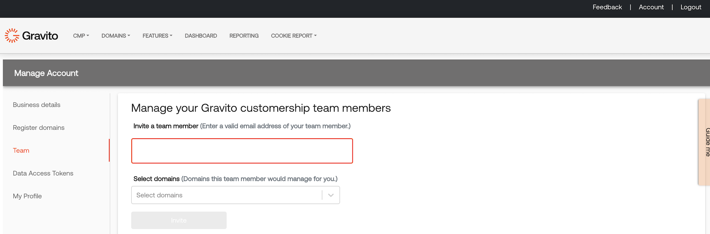

Register
========

Before you can start using Gravito features you will need to register yourself in the Gravito portal. Head to [https://adminv2.gravito.net](https://adminv2.gravito.net/) and enter your email you want to use with Gravito:

After submission you will receive an email with PIN code, enter that to application:

After successful login Gravito needs to know few more details about your business:

After completion you will land to Gravito administration application:

If you have colleagues to invite to work on the same domain(s) and/or business account, head to upper right corner and click on “**Account**“. You will find “**Team**” option:

Fill in the email address you want to invite and set the domain access as needed :

After submission the invitee should receive an email containing link to activate the access to the business account.