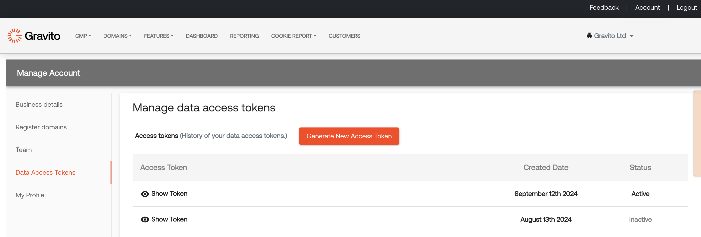
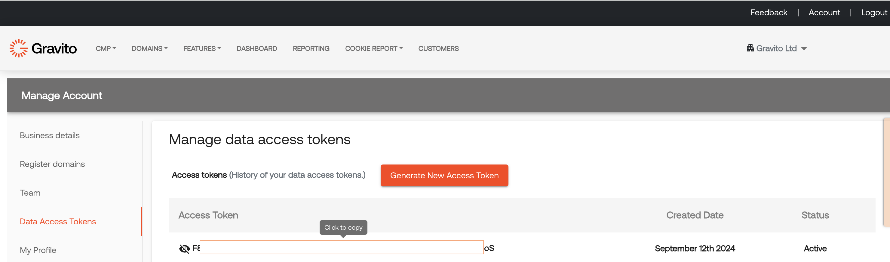

Customer data access API
============

Gravito provides an easy access to the customer data that gravito stores in its backend for the customers who are using Gravito's first party capabilities. Gravito provides an api using with a customer can fetch data for the last 7 days.

**Create an access token**

In order to access the customer data using api, you need to generate an access token using Gravito's Admin portal. Login to Admin portal and go to account section of the of the portal and select Data Access Tokens menu.



In order to generate a new token, click on the "Generate New Access Token" button. It will generate a new token and it will be available in the list below. 

You can generate a new token when ever you wish to, to see the token click on "Show Token" icon, it will show the token and you would be able to copy active token in the clipboard. 




**How to access the customer data?**

Gravito provides an open api, using which customer data can be accessed. 

```javascript
(function () { 
    var xhr = new XMLHttpRequest(); 
    xhr.open("GET", 'https://apiv2.gravito.net/api/gp/gravitocustomerdata?domainName=<yourdomain>', true); 
    xhr.withCredentials = true; 
    xhr.setRequestHeader('gravitoaccess', '<your_gravitoaccess_token_generated on admin portal>'); 
    xhr.onreadystatechange = function(response) { 
        if(xhr.readyState == XMLHttpRequest.DONE && xhr.status == 200) { 
            console.log("GET response : " + response.target.response); 
        } 
    } 
  
    xhr.send(); 
})();
``` 
