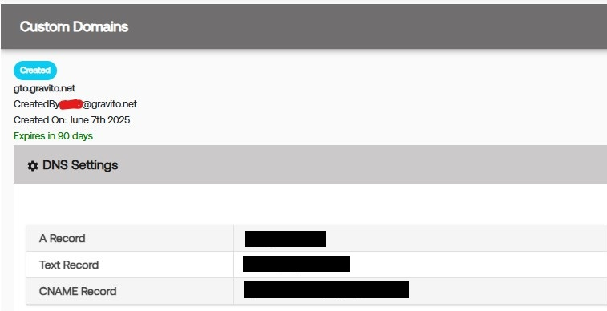

## Setup and Validation
First Party domain means the domain your website operates. e.g. website.com. To avoid third party cookies being blocked (occurs already on many browsers) you can configure the CMP to set the cookies under first party domain or you can use Gravito’s first party API to store and retrieve other valuable profile data.

To get started with first party setup, you first need to set up domain in [Gravito’s admin panel](https://adminv2.gravito.net)


### Step 1 : Setup 

**Setup of first party domain**

Once you have configured your domain gto.website.com, you need to do the DNS changes for your domain. These steps are varying between different DNS providers, generally you have to configure three records:
 
  

### Step 2 : Validation

**First party domain configuration**
After you have made the DNS records (A, TXT and CNAME), allow the changes to propagate to DNS servers (few minutes at least) and then press “Validate” button. After succesful validation you should see domain status as “Validated”:


### Step 3 : Web

**Setting up on Web**

Once the DNS entries are done and validated, you can include our SDK. We have attached the sample script which for e.g. you can include inside a GTM tag or implement it directly on your website.

```js
function waitForOrGetVendorConsent(vendorId, callback) {
  if (typeof __tcfapi !== "function") {
    return callback(new Error("__tcfapi is not available."));
  }

  // First, check if we already have the TCData available
  __tcfapi("getTCData", 2, function (tcData, success) {
    if (success && tcData && tcData.vendor && tcData.vendor.consents) {
      var hasConsent = tcData.vendor.consents[vendorId] === true;
      // If consent string already exists and eventStatus isn't 'tcloaded', we can resolve
      if (
        tcData.eventStatus === "useractioncomplete" ||
        tcData.eventStatus === "tcloaded"
      ) {
        return callback(null, hasConsent);
      }
    }

    // Otherwise, wait for consent update via event listener
    var listener = function (updatedData, ok) {
      if (!ok || !updatedData) return;

      if (updatedData.vendor && updatedData.vendor.consents) {
        var hasConsent = updatedData.vendor.consents[vendorId] === true;
        // Clean up listener
        __tcfapi("removeEventListener", 2, function () {}, listener);
        callback(null, hasConsent);
      }
    };

    __tcfapi("addEventListener", 2, listener);
  });
}

function initilizeGravitoSDK(callback) {
  try {
    window.gravitoPROCMPConfig = {
      settings: {
        sdkVersion: 3,
      },
    };
    var gravitoSDKTag = document.createElement("script");
    gravitoSDKTag.src = "https://cdn.gravito.net/prosdk/latest/sdk.js";
    gravitoSDKTag.onload = function () {
      window.gravito.init("firstParty");
      gravito.state.subscribe(
        function (value) {
          // first Party is now loaded and sdk is fully initialized
          callback(null, value.firstPartyLoaded);
        },
        function (currentState, prevState) {
          return currentState.firstPartyLoaded !== prevState.firstPartyLoaded;
        }
      );
    };
    document.body.appendChild(gravitoSDKTag);
  } catch (error) {
    callback(error);
  }
}

function main() {
  var vendorId = 1347; // gravito TCF vendorId
  waitForOrGetVendorConsent(vendorId, function (error, hasConsent) {
    if (error) {
      console.error("Error checking vendor consent:", error);
      return;
    }

    if (hasConsent) {
      console.log("User has given consent for vendor ID " + vendorId + ".");
      // Initialize Gravito SDK
      initilizeGravitoSDK(function (err, isLoaded) {
        if (err) {
          console.error("Error initializing Gravito SDK:", err);
          return;
        }

        if (isLoaded) {
          console.log("Gravito SDK is loaded and initialized.");
          // You can now use the Gravito SDK
          var gravitoFPid = window.gravito.firstParty.profile.i;
          console.log("Gravito FP ID:", gravitoFPid);
          // Do somethign with FP id.
          // for eg. pass as the 
      });
    } else {
      console.log("User has not given consent for vendor ID " + vendorId + ".");
    }
  });
}
var waitPeriod = 0;
function whenAvailable(name, callback) {
  var interval = 250; // ms

  if (window[name]) {
    waitPeriod = 0;
    callback(window[name]);
    return;
  }
  if (this.waitPeriod >= 1500) {
    console.error("No TCF CMP in context");
    return;
  }
  window.setTimeout(function () {
    if (window[name]) {
      waitPeriod = 0;
      callback(window[name]);
    } else {
      waitPeriod = waitPeriod + 250;
      whenAvailable(name, callback);
    }
  }, interval);
}

whenAvailable("__tcfapi", function (tcfApi) {
  console.log("TCF API is available");
  main();
});
```

For.eg. this script above basically looks for the consent of the vendor Gravito (1347) from your CMP and based on consent initiates the SDK to provision the PPIDs which you will need. 

### Step 4 : Mobile

**Setting up on mobile**

The sample repo is present here at [GitHub - GravitoLtd/gravitoAndroidFPv3](https://github.com/GravitoLtd/gravitoAndroidFPv3)
Please go through the read me file to understand more about the implementation

You can use the input domains which are your  "xyz.com" and the app domain as for eg : "myapp.xyz.com" (some sub - domain)
