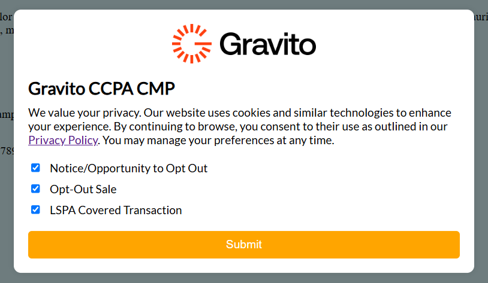

# Getting Started

## Introduction

Gravito CCPA CMP is a Consent Management Platform (CMP) that helps you manage user consent for your website. It is designed to help you comply with the [California Consumer Privacy Act (CCPA)](../Gravito_CCPA_CMP/About_Ccpa.md) and other privacy regulations.

## Features

- **Consent Management**: Manage user consent for your website.
- **CCPA Compliance**: Comply with the California Consumer Privacy Act (CCPA).
- **Customizable**: Customize the CMP to match your website's look and feel.
- **Easy Integration**: Easily integrate the CMP with your website.

## CMP Preview

Here is a preview of the Gravito CCPA CMP:



## CCPA CMP Configuration

Here you can find the configuration options for the Gravito CCPA CMP.

<table>
    <tr>
        <th>Property Name</th>
        <th>Purpose</th>
        <th>Datatype</th>
    </tr>
    <tr>
        <td>title</td>
        <td>The title of the CMP.</td>
        <td style="text-align: center;">String</td>
    </tr>
    <tr>
        <td>introductionText</td>
        <td>The introduction text displayed at the top of the CMP below title.</td>
        <td style="text-align: center;">String</td>
    </tr>
    <tr>
        <td>cookieName</td>
        <td>The name of the cookie used to store user preferences.</td>
        <td style="text-align: center;">String</td>
    </tr>
    <tr>
        <td>cookieExpiry</td>
        <td>The expiry time of the cookie in days.</td>
        <td style="text-align: center;">Number</td>
    </tr>
    <tr>
        <td>defaultUspString</td>
        <td>The default USPrivacy string to be used if the cookie is not present.</td>
        <td style="text-align: center;">String</td>
    </tr>
    <tr>
        <td>consents</td>
        <td>The list of consents to be displayed in the CMP.</td>
        <td style="text-align: center;">Array</td>
    </tr>
    <tr>
        <td>consents[i] > name</td>
        <td>The name of the consent.</td>
        <td style="text-align: center;">String</td>
    </tr>
    <tr>
        <td>consents[i] > label</td>
        <td>The label of the consent.</td>
        <td style="text-align: center;">String</td>
    </tr>
    <tr>
        <td>logoUrl</td>
        <td>The URL of the logo to be displayed in the CMP.</td>
        <td style="text-align: center;">String</td>
    </tr>
    <tr>
        <td>style</td>
        <td>The style configuration of the CMP.</td>
        <td style="text-align: center;">Object</td>
    </tr>
    <tr>
        <td>style > customCss</td>
        <td>The custom CSS to be applied to the CMP.</td>
        <td style="text-align: center;">String</td>
    </tr>
    <tr>
        <td>style > fonts</td>
        <td>The font configuration of the CMP.</td>
        <td style="text-align: center;">Array</td>
    </tr>
    <tr>
        <td>style > fonts[i] > url</td>
        <td>The URL of the font file.</td>
        <td style="text-align: center;">String</td>
    </tr>
    <tr>
        <td>style > fonts[i] > unicodeRange</td>
        <td>The unicode range of the font.</td>
        <td style="text-align: center;">String</td>
    </tr>
    <tr>
        <td>componentUrl</td>
        <td>The URL of the component to be loaded in the CMP.</td>
        <td style="text-align: center;">String</td>
    </tr>
</table>

## Example Configuration

```json
{
  "title": "Gravito CCPA CMP",
  "introductionText": "This is a testing model for Gravito's CCPA compliant CMP.",
  "cookieName": "usprivacy",
  "cookieExpiry": 30,
  "defaultUspString": "1NNN",
  "consents": [
    {
      "name": "notice",
      "label": "Notice/Opportunity to Opt Out"
    },
    {
      "name": "optOutSale",
      "label": "Opt-Out Sale"
    },
    {
      "name": "lspa",
      "label": "LSPA Covered Transaction"
    }
  ],
  "logoUrl": "https://cdn.gravito.net/logos/Gravito-logo-Dark.png",
  "style": {
    "customCss": "",
    "fonts": [
      {
        "url": "https://fonts.gstatic.com/s/lato/v17/S6uyw4BMUTPHjxAwXjeu.woff2",
        "unicodeRange": "U+0100-024F, U+0259, U+1E00-1EFF, U+2020, U+20A0-20AB, U+20AD-20CF, U+2113, U+2C60-2C7F, U+A720-A7FF;"
      },
      {
        "url": "https://fonts.gstatic.com/s/lato/v17/S6uyw4BMUTPHjx4wXg.woff2",
        "unicodeRange": "U+0000-00FF, U+0131, U+0152-0153, U+02BB-02BC, U+02C6, U+02DA, U+02DC, U+2000-206F, U+2074, U+20AC, U+2122, U+2191, U+2193, U+2212, U+2215, U+FEFF, U+FFFD;"
      }
    ]
  },
  "componentUrl": "https://gravitocdn.blob.core.windows.net/ccpa"
}
```

<div class="rst-footer-buttons" role="navigation" aria-label="Footer Navigation">
    <a href="../../Gravito_Intelligent_CMP/Advanced_Features/" class="btn btn-neutral float-left" title="Advanced Features"><span class="icon icon-circle-arrow-left"></span> Previous</a>
    <a href="../About_Ccpa" class="btn btn-neutral float-right" title="About CCPA">Next <span class="icon icon-circle-arrow-right"></span></a>
</div>
