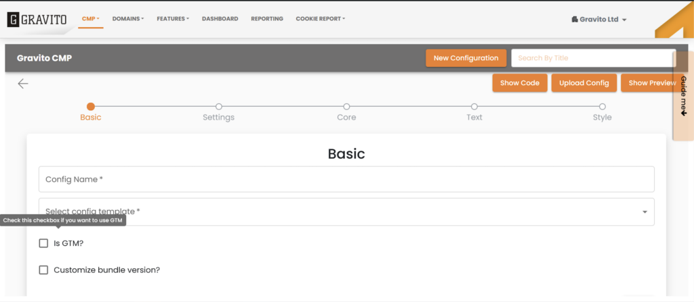

GTM Template
============

Gravito CMP now can be deployed using GTM Template. In order to use this feature, while creating the configuration for Gravito CMP you will have to check the "Is GTM?" flag in the basic section of the configuration wizard.

If the config is created using the "is GTM? " flag then In the list view we can see an additional GTM icon in front of it. By clicking on the icon we can copy the Unique GTM token of the config which can be used in your GTM container.

Now go to your Google Tag Manager, and while creating a GTM tag search for Gravito Lite Custom Template

Inside the tag configuration UI, paste your GTM token, Which you copied from the configurator UI of the Gravito admin portal.

Add your required Triggers and then click on save. This template will now use the configuration that you have created and will add Gravito CMP to your website.