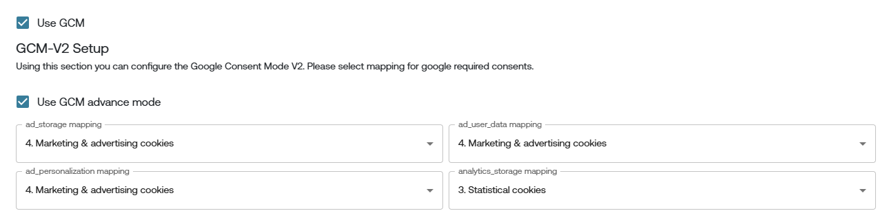

# Google Consent Mode v2

## 🔍 What is Google Consent Mode v2?

**Google Consent Mode v2** allows you to adjust how Google tags (like GA4, Google Ads, Floodlight) behave based on the user's consent choices. This helps ensure compliance with data protection regulations while still enabling important site functionality.

Consent Mode v2 particularly impacts:

- 🍪 **Cookies**
- 🎯 **Ad Personalization**
- 📊 **Analytics Tracking**

With **Consent Mode v2**, Google introduced two **new consent signals** required to comply with the **EU Digital Markets Act (DMA)**:

### ✅ Consent Signals:
1. `ad_storage`
2. `analytics_storage`
3. `ad_user_data` (🆕)
4. `ad_personalization` (🆕)

> The new signals `ad_user_data` and `ad_personalization` are essential under DMA for platforms like Google Ads and should be set according to user consent.

🔗 **[Official Google Documentation on Consent Mode v2](https://developers.google.com/tag-platform/devguides/consent)**

---

## 🛠️ Enabling Google Consent Mode v2 in Gravito CMP

Gravito CMP supports two ways to enable Consent Mode v2:

---

### ✅ 1. With GTM Template
comming soon

---

### ⚙️ 2. Without GTM Template

You can also enable GCMv2 in your **Gravito CMP** or **TCF CMP** by modifying the CMP configuration directly in the Gravito Admin Portal.

#### Steps:

1. **Login** to the Gravito Admin Portal.
2. Click on the **"CMP"** tab.
3. Select the Gravito CMP from the option.
4. On the CMP Config listing page, click the **"New"** button to create a new CMP.
5. Fill in the **basic information**, then click **Next** at the bottom-left corner.
6. On the **Consent Category** page:
   - **Tick the checkbox** labeled **"Use GCMv2"**.
   - This will open a section for **Google Consent Mode mapping**.

    

#### Consent Mapping:

You’ll now see dropdowns to map categories for the following Google consent signals:
- `ad_storage`
- `analytics_storage`
- `ad_user_data`
- `ad_personalization`

For each of these, select the relevant **consent category** from the dropdown list.

 

Once mappings are complete, click **Save** at the bottom-right.

You may continue filling out the other CMP configuration steps, or jump directly to the **"Deploy"** tab.

---

#### Deployment (Without Template):

1. In the Deploy tab, you'll see multiple deployment options.
2. Since we’re not using the GTM template, click on **"Deployment Script"**.
3. Click **"Publish"**.

  

> ⚠️ **Note:** When you click **Publish**, the system will validate all required fields. If anything is missing, it will display an error.

Once the config is published, you’ll be provided with a **deployment script**, which you can embed directly in your webpage to activate Consent Mode v2.

---

