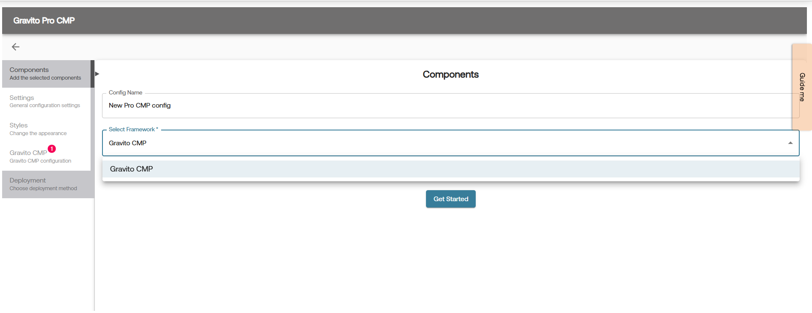
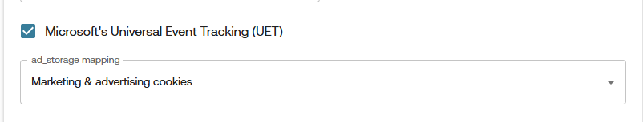

# Microsoft Consent Mode (UET)

## Enabling Microsoft Consent Mode in Pro Gravito CMP

Pro Gravito CMP supports two ways to enable Microsoft's Universal Consent Mode:

### 1. Using Configurator

1. **Login** to the Gravito Admin Portal.
2. Click on the **CMP** tab.
3. Select the **Gravito Pro CMP Configurator** from the option.
4. On the CMP Config listing page, click the **New Configuration** button to create a new CMP config.
5. Give config an appropriate name and choose **Gravito CMP** as **Framework**. After that, click **Get Started** to proceed.
        

6. Now navigate to **Gravito CMP** tab and **Consent Categories** sub-tab for UET related setup.
7. You can enable UET by checking the checkbox labeled **Microsoft's Universal Event Tracking (UET)**.
8. After enabling UET, an additional field will appear for configuration.
    

#### Consent Mapping:

You’ll now see dropdowns to map category for : `ad_storage`

Select the relevant **consent category** from the dropdown list.

**Note:** This mapping is for the `ad_storage` signal only is common across both GCMv2 & UET.

Once mapping is complete, click **Save Progress** at the top-right. Now you have successfully enabled Microsoft UET Consent Mode in your CMP configuration.

You may continue filling out the other CMP configuration steps, or jump directly to the **Deployment** tab.

### 2. Without Configurator

1.  **Enable UET Mode**:  
    Add the `useUET` flag under the `gravitoCMP.core` section of your configuration and set its value to `true`.

     <pre><code>
     gravitoCMP: {
         "core": {
             "useUET": true,
             // ... other configurations
         }
         // ... other sections
     }
     </code></pre>

2.  Add `adsConsentId`

    You must also define the `adsConsentId` property in your configuration. This is required to map consent values for Microsoft UET. There are two cases:

    - **If Google Consent Mode is already configured**:

          The `adsConsentId` property will already be available in your config.

    - **If not configured**:

          Add the `adsConsentId` property under the `gravitoCMP.core` section of your config manually.

3.  Define `adsConsentId` Based on CMP Type

    The `adsConsentId` should be a **single ID** referring to the custom consent item that you have defined in the config. It is not an array of TCF purpose IDs in this case.

      Example:
      <pre><code>
        gravitoCMP: {
            "core": {
                "useUET": true,
                "adsConsentId": "{{YOUR_CONSENT_ITEM_ID}}"
                // ... other configurations
            },
        }
      </code></pre>

      This means the consent value of the item with ID `"{{YOUR_CONSENT_ITEM_ID}}"` will be used for Microsoft UET.

4.  How Gravito CMP Handles UET Consent

    Once the above configuration is complete:

    - Microsoft UET mode is considered **enabled**.
    - Gravito CMP adds the corresponding ads consent value (`denied` or `granted`) to the global `uetq` window object.
    - By default, the value is `denied`.
    - After consent is obtained, the CMP updates the value based on the mapping defined in `adsConsentId`.

    Microsoft reads this value from the `uetq` object to determine whether tracking is allowed.

    Gravito CMP's follow the approach mentioned [Here](https://help.ads.microsoft.com/#apex/ads/en/60119/1-500)
