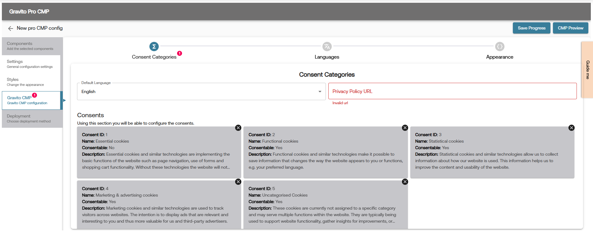

# PRO CMP - Gravito CMP Component

## What is Gravito CMP?
Gravito CMP Component is a part of Gravito Pro CMP, used to deploy Gravito's Intelligent CMP. It is a lightweight CMP suitable for any website. It is not TCF certified. Gravito Intelligent CMP is a consent management solution that helps collect consent for data collection, analytics, targeting, personalization, and whatever your business needs to fulfill legal or regulatory requirements.

## How to use Gravito CMP Component in PRO CMP?
You can use the Gravito CMP component in your PRO CMP while setting up your configuration. In PRO CMP Configurator's components tab, choose the **Gravito CMP** component and then configure it as per your requirement.


## How to setup Gravito CMP Component?
Gravito CMP setup can be done using Pro CMP Configurator on Gravito’s Admin Portal.
Once you have selected the Gravito CMP component in the configurator, it will add the Gravito CMP tab in the left sidebar of the configurator. Click on it to open the Gravito CMP-specific configurator area.



In this section, you will find the following tabs:

- **Consent Categories**: This tab is used to configure the consent-based settings. Here, you can configure the consent item, enable/disable various integrations such as Google Consent Mode, Microsoft UET, etc., as well as adjust some advanced settings.
> **Note**: Details on how to integrate with Google Consent Mode and Microsoft UET are already covered in the [Gravito CMP UET](./Gravito_cmp_uet.md) and [Gravito CMP GCM](./Gravito_cmp_gcmv2.md) documentation.

- **Languages**: This tab is used to configure the languages for the CMP. You can add multiple languages and configure the text for each language.

- **Appearance**: This tab is used to configure the appearance of the CMP. In this tab, you can override the default styles of the CMP and configure the styles (CSS classes) as per your requirement.
In the provided code editor on this tab, you can add the CSS classes to override the default styles of the CMP.
> **Note**: Whatever CSS classes you add in this tab will be added as a separate stylesheet in the head of the page. So you can basically add any CSS syntax in this editor.

Help Content for each field is provided in the configurator itself. You can hover over the each field to see the help content.

## Event & Integration

Gravito CMP Component, when used with PRO CMP, dispatches various events in its lifecycle. All these events are dispatched under the common namespace of `gravito:cmp:light`. You can listen to these events on your website and take the required action.

To listen to these events, use the following code:
```javascript
window.addEventListener('gravito:cmp:light', function (event) {
      let eventType = event.detail.eventType;
        // your code here
});
``` 
To access the current consent state of the CMP, use the following code:
```javascript
const getGravitoConsentCookieData = (cname) => {
    var name = cname + "=";
    var decodedCookie = decodeURIComponent(document.cookie);
    var ca = decodedCookie.split(";");
    for (var i = 0; i < ca.length; i++) {
      var c = ca[i];
      while (c.charAt(0) == " ") {
        c = c.substring(1);
      }
      if (c.indexOf(name) == 0) {
        return c.substring(name.length, c.length);
      }
    }
    return "";
  };
let consentCookieName = window.gravitoPROCMPConfig.gravitoCMP.core.cookieName;
let cookieData = getGravitoConsentCookieData(consentCookieName);
let currentState = cookieData && JSON.parse(cookieData);
// Current state will have the following structure:

// {
//   "Model": [
//       {
//           "id": 1,
//           "name": "Your Consent",
//           "isConsentable": true,
//           "consent": true
//       },
//   ]
// }
```

You can use the above two code snippets to listen to events and get the current consent state of the CMP. 
For example, if you want to perform some action whenever a user gives/modifies consent, you can use the following code:
```javascript
const getGravitoConsentCookieData = (cname) => {
    var name = cname + "=";
    var decodedCookie = decodeURIComponent(document.cookie);
    var ca = decodedCookie.split(";");
    for (var i = 0; i < ca.length; i++) {
      var c = ca[i];
      while (c.charAt(0) == " ") {
        c = c.substring(1);
      }
      if (c.indexOf(name) == 0) {
        return c.substring(name.length, c.length);
      }
    }
    return "";
  };
window.addEventListener('gravito:cmp:light', function (event) {
      let eventType = event.detail.eventType;
      let consentUpdateEventsList = [
        "layer1:opt-out:all",
        "layer2:opt-out:all",
        "layer2:opt-in:selected",
        "layer1:opt-in:all",
        "layer2:opt-in:all",
        "opt-in:previously",
      ];
      if (consentUpdateEventsList.includes(eventType)) {
        // Get the current consent state
        let consentCookieName = window.gravitoPROCMPConfig.gravitoCMP.core.cookieName;
        let cookieData = getGravitoConsentCookieData(consentCookieName);
        let currentState = cookieData && JSON.parse(cookieData);
        // Do your action here
      }
});
```

Below is the list of event types  dispatched by the Gravito CMP component:

| Event Name | Description |
|------------|-------------|
| layer1:opt-out:all | This event is dispatched when a user opts out of all categories in layer 1 (Declaration Tab), i.e., clicked on the Reject All button on layer 1. |
| layer2:opt-out:all | This event is dispatched when a user opts out of all categories in layer 2 (Details Tab), i.e., clicked on the Reject All button on layer 2. |
| layer2:opt-in:selected | This event is dispatched when a user opts in to selected categories in layer 2 (Details Tab), i.e., clicked on the Accept Selected button. |
| layer1:opt-in:all | This event is dispatched when a user opts in to all categories in layer 1 (Declaration Tab), i.e., clicked on the Accept All button. |
| layer2:opt-in:all | This event is dispatched when a user opts in to all categories in layer 2 (Details Tab), i.e., clicked on the Accept All button. |
| layer1:settings | This event is dispatched when a user clicks the settings button on layer 1. |
| opt-in:previously | This event is dispatched when the user has already given consent and a consent cookie is present in the browser. |
| opt-in:previously:outdated | This event is dispatched when the user has already given consent but the consent cookie is outdated. |
| cmploaded | This event is dispatched when the CMP is loaded and ready to use. |
| ui-shown | This event is dispatched when the CMP UI is shown to the user. |
| gcm:default | This event is dispatched when the GCM default event is added to the dataLayer. This is specific to GCMv2 integration and will not fire if GCMv2 is not enabled or if using a GTM Template. |

# FAQ's

- [How to Resurface the CMP UI to All users and Collect Consent Again?](../../FAQ/How_to_resurface_ProCMP.md)

- [How to use your custom font in CMP?](../../FAQ/How_to_addCustomFonts.md)

