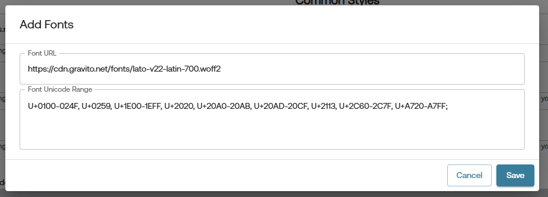

# Customizations in PRO CMP

Gravito's PRO CMP is a highly customizable solution that allows you to tailor the user experience to meet your specific needs. These customizations can be made through the **Styles** tab in Gravito's PRO CMP configurator.
 
    

## Styles Tab Fields

The **Styles** tab allows you to configure the appearance of your CMP. Below are the fields available for customization:

### 1. Logo URL
- **Description**: URL of the logo to be displayed in the CMP.
- **Example**: `https://gravitocdn.blob.core.windows.net/logos/Website_DEMO_logo.png`
- **Note**: It is recommended to use a logo that aligns with your brand identity.

### 2. Logo Alternate Text
- **Description**: Alternate text for the logo, used for accessibility.
- **Example**: `Website Logo`
- **Note**: This text will be displayed if the logo cannot be loaded.

### 3. Primary Color Code
- **Description**: The primary color used in the CMP interface.
- **Input Format**: Hexadecimal color code (e.g., `#f07e26`).
- **Note**: Choose a color that matches your brand's primary theme.

### 4. Secondary Color Code
- **Description**: The secondary color used in the CMP interface.
- **Input Format**: Hexadecimal color code (e.g., `#a3a3a3`).
- **Note**: This color is typically used for less prominent elements.

### 5. Header Color Code
- **Description**: The color used for the header section of the CMP.
- **Input Format**: Hexadecimal color code (e.g., `#f07e26`).
- **Note**: Ensure this color contrasts well with the text for readability.

### 6. Footer Color Code
- **Description**: The color used for the footer section of the CMP.
- **Input Format**: Hexadecimal color code (e.g., `#f07e26`).
- **Note**: Similar to the header, ensure good contrast for readability.

    

### 7. Fonts
- **Description**: Add custom fonts to be used in the CMP.
- **Fields**:
    - **Font URL**: URL pointing to the font file (e.g., `https://cdn.gravito.net/fonts/lato-v22-latin-700.woff2`).
    - **Font Unicode Range**: Unicode range for the font (e.g., `U+0100-024F, U+0259, U+1E00-1EFF`).
- **Actions**:
    - **Add Font**: Add a new font configuration by clicking the **+ Add Font** button after which a modal will appear where you can add new font.
        
    - **Reset to Default**: Revert to the default font settings.
- **Note**: Ensure the font URL is accessible and the Unicode range covers the required characters.

## Additional Customizations

Apart from the styles tab, you can also customize the look and feel of the CMP by adding custom CSS. This allows for more granular control over the appearance of various elements within the CMP. You can add your CSS code in the **Custom CSS** editor field in the **Appearence** sub-tab of the selected framework.

