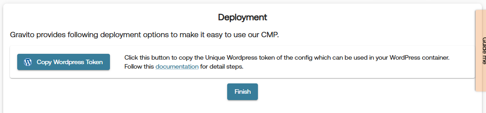

# Deployment for Gravito Pro CMP Configuration

All deployment related actions for Gravito Pro CMP are handled through **Deployment** tab in the Pro CMP Configurator. This tab is available as the last tab in the sidebar of the configurator.

Gravito Pro CMP supports multiple deployment options to suit different environments and use cases. Below are the available deployment methods:

## 1. GTM (Google Tag Manager) Template:
This option allows you to quickly integrate Gravito's CMP with your website using Google Tag Manager. Please follow the steps below to deploy using GTM:

1. Select the **GTM Template** option from the provided **Deployment Method** and click **Validate & Publish** button.

    

2. if the validation and publishing is successful, you will get an option to copy GTM Token by clicking on the **Copy GTM Token** button.

    

## 2. WordPress Plugin:
Seamlessly integrate Gravito's CMP into your WordPress website using our dedicated plugin. Please follow the steps below to deploy using the WordPress plugin:

1. Select the **WordPress Plugin** option from the provided **Deployment Method** and click **Validate & Publish** button.

    

2. if the validation and publishing is successful, you will get an option to copy WordPress Token by clicking on the **Copy WordPress Token** button.

    

## 3. Deployment Script:
Utilize the deployment script to efficiently incorporate Gravito's CMP into your website's codebase. Please follow the steps below to deploy using the deployment script:

1. Select the **Deployment Script** option from the provided **Deployment Method** and click **Validate & Publish** button.

    

2. if the validation and publishing is successful, you will get an option to **Generate Deployment Script** and **Download Config**.

    

3. Click on the **Generate Deployment Script** button to generate the deployment script. This will open a modal with the generated script as shown in below image. You can paste this script in your website's `<body>` tag.

    