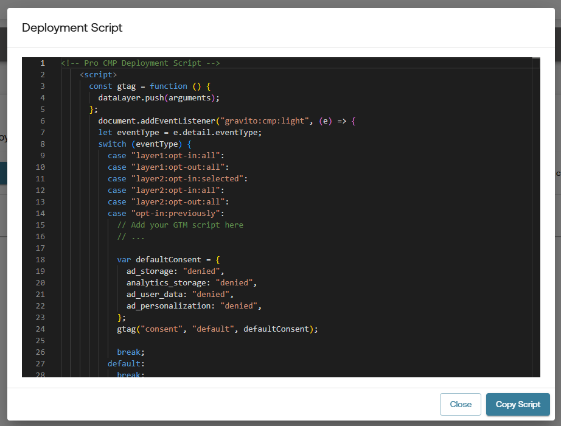

# Google Consent Mode v2

## What is Google Consent Mode v2?

**Google Consent Mode v2** allows you to adjust how Google tags behave based on the user's consent choices. This helps ensure compliance with data protection regulations while still enabling important site functionality.

Consent Mode v2 particularly impacts:

- **Cookies**
- **Ad Personalization**
- **Analytics Tracking**

With **Consent Mode v2**, Google introduced two **new consent signals** required to comply with the **EU Digital Markets Act (DMA)**:

### Consent Signals:
- `ad_storage`
- `analytics_storage`
- `ad_user_data` (🆕)
- `ad_personalization` (🆕)

> The new signals `ad_user_data` and `ad_personalization` are essential under DMA for platforms like Google Ads and should be set according to user consent.

**[Official Google Documentation on Consent Mode v2](https://developers.google.com/tag-platform/devguides/consent)**

---

## Enabling Google Consent Mode v2 in Pro Gravito CMP

### Creating Config in Admin Portal

1. **Login** to the Gravito Admin Portal.
2. Click on the **CMP** tab.
3. Select the **Gravito Pro CMP Configurator** from the option.
4. On the CMP Config listing page, click the **New Configuration** button to create a new CMP Config.
5. Give config an appropriate name and choose **Gravito CMP** as **Framework**. After that, click **Get Started** to proceed.
        

6. Now navigate to **Gravito CMP** tab and **Consent Categories** sub-tab for GCMv2 related setup.
7. You can enable GCM by checking the checkbox labeled **Google's GCM-V2**.
8. After enabling GCM, some additional fields will appear for configuration.
    

    - **Use GCM Advance Mode** is enabled by default. You can uncheck this if you want to use the **Basic Mode**.
    - All other fields are related to Google consent signal mapping. They are explained below.

**Note:** when the using GCM Basic Mode, the **GTM template** deployment option will not be available.

#### Consent Mapping:

You’ll now see dropdowns to map categories for the following Google consent signals:
- `ad_storage`
- `analytics_storage`
- `ad_user_data`
- `ad_personalization`

For each of these, select the relevant **consent category** from the dropdown list. You will see default mappings, but you can change them as per your requirements.

Once mappings are complete, you may continue filling out the other CMP configuration steps, or jump directly to the **Deployment"** tab for publishing your config.


>**Note:** If you are using **GCM Basic Mode**, you will see additional logic in your deployment script.

   

   below the comment `// Insert your GTM script here` you can add your GTM script. You can get the GTM script from your GTM account. It will look like this:
   
```js
(function (w, d, s, l, i) {
  w[l] = w[l] || [];
  w[l].push({ "gtm.start": new Date().getTime(), event: "gtm.js" });
  var f = d.getElementsByTagName(s)[0],
    j = d.createElement(s),
    dl = l != "dataLayer" ? "&l=" + l : "";
  j.async = true;
  j.src = "https://www.googletagmanager.com/gtm.js?id=" + i + dl;
  f.parentNode.insertBefore(j, f);
})(window, document, "script", "dataLayer", "{{Your_GTM_ID}}");
```