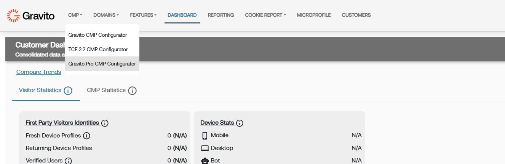
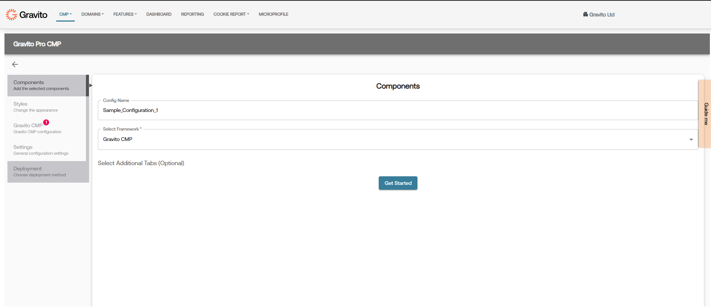

Gravito Pro CMP Setup can be done using Pro CMP Configurator on Gravito’s Admin Portal.

Go to CMP >> Pro CMP configurator.

Click on "New Configuration" button to create a new configuration.

Click on "Get Started" button after adding a Config name and selecting a appropriate framework.

You can now go through each of the section and configure the CMP as per your requirement.
