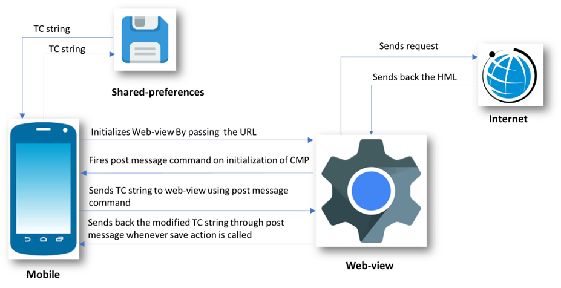
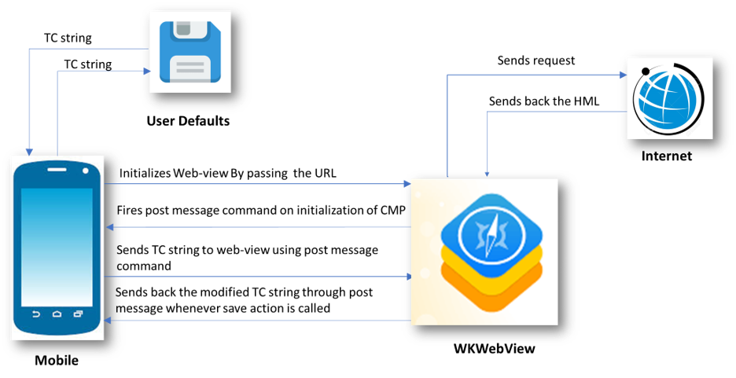
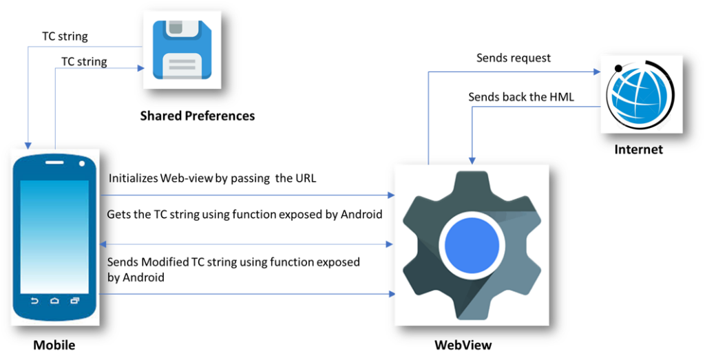

TCF CMP implementation on mobile apps can take two different strategies:

1.  You have TCF CMP already configured and set up for your website or you are planning to have such AND your application is made with webviews (= content is displayed on webviews and 3rd party vendor scripts and tags are loaded on those as would on ordinary browser)
2.  Your app runs natively (without webviews) and TCF CMP needs to be implemented natively AND/OR your application is using SDKs for mar/adtech.

There can be hybrids of above so mixing features is still possible.

### Option 1 : Same TCF CMP setup for website and mobile app(s)

Assuming that you have TCF CMP already setup for your website(s). Easiest way to deploy the same for your mobile application is to include it on the app via webview. You can host a blank page containing CMP on your site or CDN. Include CMP scripts and configuration on it and load the URL inside the app. The core requirement is that all content comes from same second level domain, ie. same CMP cookie is accessible on all webviews.

### Option 2 : Native apps, CMP embedded via webview

Native app integration requires a bit different approach per application architecture:

-   React Native (example project : <https://github.com/GravitoLtd/react-native-webview-sample>)
-   Android Native (<https://github.com/GravitoLtd/android-webview-sample>)
-   iOS Native (<https://github.com/GravitoLtd/ios-webview-sample>)
-   Flutter ([](https://github.com/GravitoLtd/flutter-webview-sample)<https://github.com/GravitoLtd/flutter-webview-sample>)

Integration
--------------------

To Integrate TCF Complaint CMP into Mobile Apps you can use Gravito's WebView-based CMP. It uses WebView to render and Manage CMP consents, and stores the consents in SharedPreferences so that they can be accessed by vendors. Gravito Supports the Integration of three major platforms Android(Native), IOS(Native), and React-Native. Integration varies from platform to platform.

Assumptions
--------------------

The document assumes that the reader  

-   Knows how to use a web-view component with the current native setup. 
-   Knows how to read and update data into the shared preferences in android and into the default storage in IOS. 

-   Knows how to pass data to and from WebView. 
-   Has access to the code base of demo Apps 
-   Is aware of TCFv2 terms such as TC string, CMP, etc.

React-Native
--------------------

Flow Diagram

The following diagram shows the flow of data for the React Native Implementation.



1.  React Native initializes the Web-view by passing the URL to our hosted CMP. This is done by passing URL as a prop to the Web-view component. 

1.  Web-view then fetches the required content from the host and loads the HTML page. 

1.  On Successful loading of the page, JavaScript sends the onStart message to react-native through the "ReactNativeWebView" window object. 

1.  This message is then received by React Native using the onMessage attribute of React Native's WebView component. 

1.  React Native then sends the TC string from shared preference to the Web-view using inject javascript function of the WebView component. This function is used to fire on message events which are then listened to by CMP inside Web-view. 

1.  CMP then use this TC string to render the current state of consent and user can change their preferences using the checkbox controls. 

1.  Whenever a user performs a save action, a modified TC string is sent back to React Native and is then stored in shared preferences. 

Sending Data From React-Native App to CMP

WebView-based CMP communicates with the native side through WebView and post-message in the case of React-Native.

WebView should send the data to CMP when the CMP code is fully loaded inside WebView. This can be insured by listening to the "CMP-loaded" post-message event from CMP this can be done in onMessage hook of WebView as done in sample app for react-native.

```
<WebView
          ref={webView => (this.webView = webView)}
          source={{
            uri: 'https://yourcdnurl/index.html?platform=reactnative',
          }}
          style={{marginTop: 0, backgroundColor: 'orange'}}
          scalesPageToFit={true}
          onLoadStart={() => this.setState({loading: true})}
          onLoad={() => {
           // use this hook to send data to CMP when html is loaded
          }}
          onMessage={event => {
            const {
              tcstring,
              type,
              currentstate,
              configversion,
              tcstringversion,
            } = JSON.parse(event.nativeEvent.data);
            console.log('type', type);
            switch (type) {
              case 'CMP-loaded':
               // here you know that CMP has been loaded in Webiview and is waiting for Data to be send by webiview
              case 'save':
                // This event will be sent when user saves the consent on CMP UI, for eg Accept All,Reject All, or Accept Selected
                break;
              case 'load':
                //here you will get load event in which you will have config version and tcversion
                break;
              case 'close':
                //here you can handle modal close event
                console.log('close event occured');
                break;
              default:
                break;
            }
          }}
        />

```

There are two possible cases in which App needs to send Data to CMP.

1.  When the user opens app for the first time.\
    When the user opens the app for the first time he has not given any consent and needs to show the first-layer consent window where he can accept all consents, reject all, or can go to the second-layer to manage the consents more granularly.\
    In this case, App Should pass an empty string to CMP through a post-message. CMP will then listen to this event as there is no data sent from the app CMP will show the first layer of UI.

2.  When the user has previously consented and want to manage/change his consents.\
    When a user comes to manage the consent, the App should Initialize the WebView and send previously stored consent data in response to "CMP-loaded".

```
case 'CMP-loaded':
        // here you know that CMP has been loaded in WebView and is waiting for Data to be send from WebView

        let dataToSend = {
            type: 'cookieData',
            tcstring: tcstring, // recived from save event  when user opted previously should be empty when user come for first time,
            nontcfdata: nontcfdata, // recived from save event  when user opted previously should be empty when user come for first time
        };

        const clientResponseCode = `
                    window.postMessage(${JSON.stringify(
                        dataToSend,
                    )}, "*");
                        true;
                        `;
        if (this.webView) {
            this.webView.injectJavaScript(clientResponseCode);
        }
        break;
```

Catching save actions on CMP UI

When user performs any save action on CMP UI, CMP will dispatch a post-message to WebView which can be handled inside onMessage handler of WebView. In our Sample Apps we save the received data as is and is provided to CMP in "CMP-loaded" event.

```
 case 'save':
        // This event will be sent when user saves the consent on CMP UI, for eg Accept All,Reject All, or Accept Selected
        // event Data will have following json object structure
        // data = {
        //   type: 'save',
        //   tcstring: 'string',
        //   currentstate: 'Object',
        //   nontcfdata: 'Object',
        //   configversion: 'number',
        //   tcstringversion: 'number',
        //   inAppTCData: 'Object',
        // };
        // this data should be stored in Shared preferences in format describe here https://github.com/InteractiveAdvertisingBureau/GDPR-Transparency-and-Consent-Framework/blob/master/TCFv2/IAB%20Tech%20Lab%20-%20CMP%20API%20v2.md#in-app-details
        break;
```

Catching close action on CMP UI

When a user performs close action on CMP UI, CMP will dispatch a post-message to WebView which can be handled inside the onMessage handler of WebView. 

```
 case 'close':
        //here you can handle modal close event
        console.log('close event occured');
        break;
```

Native IOS
-------

Flow Diagram

The following diagram shows the flow of data for the IOS Implementation.



1.  IOS initializes the WKWebView by passing the URL to our hosted CMP. This is done by using the "loadTheUrl" function of the "ViewController" class. 

1.  WKWebView then fetches the required content from the host and loads the HTML page. 

1.  On Successful loading of the page, JavaScript sends the onStart message to IOS through "webkit.messageHandlers.jsHandler" window object. 

1.  This message is then handled by the "userContentController" function of ViewController class. 

1.  IOS then sends the TC string from UserDefaults to the WKWebView using the "evaluateJavaScript" function of WebView. This function is used to fire on message events which are then listened by CMP inside WebView. 

1.  CMP then use this TC string to render the current state of consent and user can change their preferences using the checkbox controls. 

1.  Whenever a user performs save action, a modified TC string is sent back to IOS and is then stored to UserDefaults

Sending Data From IOS App to CMP

WebView-based CMP communicates with the native side through WebView and post-message in the case of React-Native.

WebView should send the data to CMP when the CMP code is fully loaded inside WebView. This can be insured by listening to the "start" post-message event from CMP this can be done in WebView as done in sample app for IOS

```
class ViewController: UIViewController ,UIWebViewDelegate,WKScriptMessageHandler,UITextFieldDelegate{

    @IBOutlet weak var TOKEN: UITextField!

    @IBOutlet weak var webview: WKWebView!

    @IBOutlet weak var showToken: WKWebView!

    override func viewDidLoad() {
        super.viewDidLoad()
        self.webview.uiDelegate = self as? WKUIDelegate
        TOKEN.delegate = self as UITextFieldDelegate
        self.loadTheUrl()
    }
    //----- FUNCTION TO LOAD HTML
    func loadTheUrl(){
        webview.configuration.userContentController.add(self, name: "jsHandler")
        webview.load(NSURLRequest(url: NSURL(string: "https://yourcdnurl/index.html?platform=ios")! as URL) as URLRequest)

    }
    func userContentController(_ userContentController: WKUserContentController, didReceive message: WKScriptMessage) {
        if message.name == "jsHandler" {
            print(message.body)
            let json = message.body as? NSDictionary
            let event = json?["event"] as? String
            print(event)
            switch event {

            case "start":
                // here you know that CMP has been loaded in Webiview and is waiting for Data to be send by webiview
            case "close":
                // here you can do clean up action on close event
            case "save":
                // This event will be sent when user saves the consent on CMP UI, for eg Accept All,Reject All, or Accept Selected
            default: break

            }
        }
    }
}
```

There are two possible cases in which App needs to send Data to CMP.

1.  When the user opens app for the first time.\
    When the user opens the app for the first time he has not given any consent and needs to show the first-layer consent window where he can accept all consents, reject all, or can go to the second-layer to manage the consents more granularly.\
    In this case, App Should pass an empty string to CMP through a post-message. CMP will then listen to this event as there is no data sent from the app CMP will show the first layer of UI.

2.  When the user has previously consented and want to manage/change his consents.\
    When a user comes to manage the consent, the App should Initialize the WebView and send previously stored consent data in response to "start".

```
 case "start":
        //here we are sending data to CMP through post message,data to be send must have following structure {

            tcstring: tcstring, // recived from save event  when user opted previously should be empty when user come for first time,
            nontcfdata: nontcfdata, // recived from save event  when user opted previously should be empty when user come for first time
        };

        guard let tcstring=UserDefaults.standard.object(forKey:"tcstring") else {
            let tcstring=""
            let startjs = "window.postMessage('\(tcstring)', \"*\");true;"
            webview.evaluateJavaScript(startjs, completionHandler: nil)
            return
        }

        print(tcstring)
        var error: NSError?

        let data = try?JSONSerialization.data(withJSONObject: tcstring, options: JSONSerialization.WritingOptions.prettyPrinted)

        if let data = data {
            let json = NSString(data: data, encoding: NSUTF8StringEncoding)
            if let json = json {
                print(json)
                let startjs = "window.postMessage(\(json), \"*\");true;"
                webview.evaluateJavaScript(startjs, completionHandler: nil)
            }
        }
```

Catching save actions on CMP UI

When user performs any save action on CMP UI, CMP will dispatch a post-message to WebView which can be handled inside WebView. In our Sample Apps we save the received data as is and is provided to CMP in "start" event.

```
 case 'save':
        // This event will be sent when user saves the consent on CMP UI, for eg Accept All,Reject All, or Accept Selected
        // event Data will have following json object structure
        // data = {
        //   type: 'save',
        //   tcstring: 'string',
        //   currentstate: 'Object',
        //   nontcfdata: 'Object',
        //   configversion: 'number',
        //   tcstringversion: 'number',
        //   inAppTCData: 'Object',
        // };
        // this data should be stored in Shared preferences in format describe here https://github.com/InteractiveAdvertisingBureau/GDPR-Transparency-and-Consent-Framework/blob/master/TCFv2/IAB%20Tech%20Lab%20-%20CMP%20API%20v2.md#in-app-details
        break;
```

Catching close action on CMP UI

When a user performs close action on CMP UI, CMP will dispatch a post-message to WebView which can be handled inside the WebView. 

```
 case 'close':
        //here you can handle modal close event
        console.log('close event occured');

```

Native Android
-------

Flow Diagram

The following diagram shows the flow of data for the Android Implementation.



1.  Android initializes the WebView by passing the URL to our hosted CMP. This is done by using the "loadUrl" function of WebView. Along with this it also exposes the object which has functionalities to get data and send data from android. This object is available as a window.Android object in WebView. Android uses "addJavascriptInterface" function of WebView to achieve this. 

1.  WebView then fetches the required content from the host and loads the HTML page. 

1.  JavaScript then gets the TC string from the android code using the functions exposed by the Window.Android object. 

1.  This TC string is then used by CMP to render the current state of consents. 

1.  When the user performs save action, modified TC string is then sent back and stored in shared preference using function exposed by the Android window object. 

Sending Data From Android App to CMP

In Android communication between Native side and CMP happens through function which are exposed by Android WebView.

WebView exposes certain functions which can be called from CMP.So CMP uses this function to send data across.

Following code explains how to handle different action that user performs on CMP UI

```
public class WebViewAdapter {
    Context mContext;
    WebViewCallback webViewCallback = null;
    /** Instantiate the interface and set the context */
    WebViewAdapter(Context c,WebViewCallback webViewCallback) {
        mContext = c;
        this.webViewCallback = webViewCallback;

    }

    @JavascriptInterface
    public void getValueFromWebView(String value) {
        // This function will called by CMP code to send data accross to Android APP
        // It Will pass different JSON object Strings for difference cases
        // FOR SAVE
        // so when user performs any save action on CMP UI such as Accept All, Reject All, or Accept Selected,
        // CMP will call this function with json string of below object
        // {
        //   type: "save",
        //   tcstring: 'string',
        //   currentstate: 'object',
        //   nontcfdata: 'object',
        //   configversion: 'string,
        //   tcstringversion: 'string,
        //   inAppTCData: 'object',,
        // };
            // this data should be stored in Shared preferences in format describe here https://github.com/InteractiveAdvertisingBureau/GDPR-Transparency-and-Consent-Framework/blob/master/TCFv2/IAB%20Tech%20Lab%20-%20CMP%20API%20v2.md#in-app-details

   FOR CLOSE
    //   When user click close button on second layer JSON object string of following object will pass to this function
    //   {
    //     type: "close",
    //     data: "cmp ui closed",
    //   }

    }

    @JavascriptInterface
    public String getValueFromStorage(){
       // This function will be called when CMP want to received data from WebView, This function should return the stringified JSON of following type
        // {
        //     tcstring:"string" // previoulsy stored string received in getValueFromWebView
        //     nontcfdata:"object" //previoulsy stored value received in getValueFromWebView
        // }
    }

}
```

Flutter
-------

Flow Diagram

The following diagram shows the flow of data for the Flutter Implementation.


1.  Flutter initializes the Web-view by passing the URL to our hosted CMP. This is done by creating WebView Controller and assigning it to the WebView Widget. 

1.  Web-view then fetches the required content from the host and loads the HTML page. 

1.  On Successful loading of the page, JavaScript sends the onStart message to WebView through the "FlutterAppWebView" window object. (Note please keep the JavaScript Channel name as "FlutterAppWebView")

1.  This message is then received by WebView's JavaScript channel using the onMessageReceived parameter.

1.  Flutter then sends the TC string from shared preference to the Web-view using runJavaScriptfunction of the WebView controller. This function is used to fire on message events which are then listened to by CMP inside Web-view. 

1.  CMP then use this TC string to render the current state of consent and user can change their preferences using the checkbox controls. 

1.  Whenever a user performs a save action, a modified TC string is sent back to Flutter and is then stored in shared preferences. 

Sending Data From Flutter App to CMP

WebView-based CMP communicates with the native side through WebView and post-message in the case of Flutter.

WebView should send the data to CMP when the CMP code is fully loaded inside WebView. This can be insured by listening to the "CMP-loaded" post-message event from CMP this can be done in onMessageReceived hook of WebView as done in sample app for Flutter. 

First create a WebView Controller and JavaScript Channel, make sure you name this channel as "FlutterAppWebView" only.

```
 controller = WebViewController()
      ..setJavaScriptMode(JavaScriptMode.unrestricted)
      ..setBackgroundColor(const Color(0x00000000))
      ..setNavigationDelegate(
        NavigationDelegate(
          onProgress: (int progress) {
            // Update loading bar.
          },
          onPageStarted: (String url) {},
          onPageFinished: (String url) {},
          onWebResourceError: (WebResourceError error) {
            print("err");
          },
          onNavigationRequest: (NavigationRequest request) {
            if (request.url.startsWith('https://www.youtube.com/')) {
              return NavigationDecision.prevent;
            }
            return NavigationDecision.navigate;
          },
        ),
      )
      ..addJavaScriptChannel(
        'FlutterAppWebView',
        onMessageReceived:(){})
```

Add listeners to various events emitted by JavaScript using javaScript channels onMessageRecievd method.and specify the CMP url to load inside the webview.

```
 ..addJavaScriptChannel(
        'FlutterAppWebView',
        onMessageReceived: (JavaScriptMessage message) async {
          var messageData = jsonDecode(message.message);
          // Obtain shared preferences.
          final SharedPreferences prefs = await SharedPreferences.getInstance();
          String messageType = messageData["type"];
          switch (messageType) {

        },
      ) ..loadRequest(Uri.parse(
          'https://gravitocdn.blob.core.windows.net/webview/index.2.3.html?platform=flutter'));

```

There are two possible cases in which App needs to send Data to CMP.

1.  When the user opens app for the first time.\
    When the user opens the app for the first time he has not given any consent and needs to show the first-layer consent window where he can accept all consents, reject all, or can go to the second-layer to manage the consents more granularly.\
    In this case, App Should pass an empty string to CMP through a post-message. CMP will then listen to this event as there is no data sent from the app CMP will show the first layer of UI.

2.  When the user has previously consented and want to manage/change his consents.\
    When a user comes to manage the consent, the App should Initialize the WebView and send previously stored consent data in response to "CMP-loaded".

```
    case "CMP-loaded":

              // this message will be fired when cmp will be loaded now app has to check it has previously stored consent
              // in native storage if yes then we need to send it to CMP else we need to send empty data
              final String? resultString = prefs.getString('cookieData');
              var storedData =
                  resultString != null ? jsonDecode(resultString) : null;

              var message = {
                "type": "cookieData",
                "tcstring": storedData != null ? storedData["tcstring"] : null,
                "nontcfdata":
                    storedData != null ? storedData["nontcfdata"] : null
              };
              String jsonMessage = jsonEncode(message);

              controller.runJavaScript(' window.postMessage($jsonMessage)');

              break;
```

Catching save actions on CMP UI

When user performs any save action on CMP UI, CMP will dispatch a post-message to WebView which can be handled inside onRecivedMessage handler of WebView. In our Sample Apps we save the received data as is and is provided to CMP in "CMP-loaded" event.

```
 case "save":

              //         messagedata will have following strucutre
              //          let onSaveMessageFlutter = {
              //   type: "save",
              //   tcstring: encodedString,
              //   currentstate: getCoreConfigDetails(),
              //   nontcfdata: nonTCFModel.Model,
              //   configversion: config.core.version,
              //   tcstringversion: tcModel.cmpVersion,
              //   inAppTCData: getInAppTCData(),
              // };

              // this message will be fired when there is save action perfomed on CMP ui inside webView,
              // data with this message should be stored in native storage
              // this is only for sample app, In production you will have to store keys in format specified here
              //https://github.com/InteractiveAdvertisingBureau/GDPR-Transparency-and-Consent-Framework/blob/master/TCFv2/IAB%20Tech%20Lab%20-%20CMP%20API%20v2.md#in-app-details
              var d = {
                "tcstring": messageData["tcstring"],
                "nontcfdata": messageData["nontcfdata"],
              };
              await prefs.setString("cookieData", jsonEncode(d));
              break;
```

Catching close action on CMP UI

When a user performs close action on CMP UI, CMP will dispatch a post-message to WebView which can be handled inside the onRecivedMessage handler of WebView.

```
 case "close":
              setState(() {
                print("close");
                _showWebView = false;
              });
              break;
```