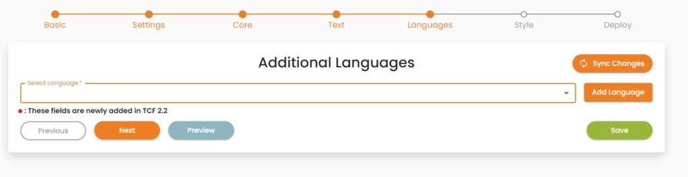
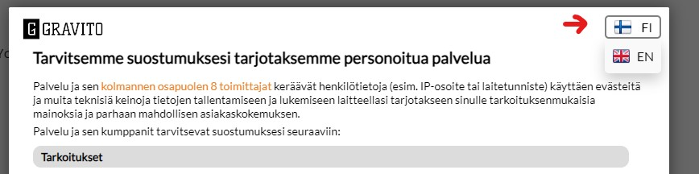

# Release Notes

## Version 5.0.2 

Release date 28/11/2024

TCF 2.2 was introduced about a year ago, and the IAB limits the validity of TC Strings to 13 months. This release includes an enhancement to our CMP core module with an additional check to ensure that invalid consents, if any, are promptly handled. **(Similar updates on named version 5 as well as older version 4)**

*Key Update in 5.0.2:*

Automatic detection of expired TC Strings: When a TC String becomes invalid, the CMP will now resurface automatically  and prompt users to  provide their consent again.

- This update ensures that all consents remain up-to-date and compliant with TCF 2.2 standards.
- This change minimizes the risk of invalid consents and enhances the reliability of your consent management process.

More details [here](./advanced/Resurfacing.md)

## Version 4.0.12

Release date 28/11/2024

TCF 2.2 was introduced about a year ago, and the IAB limits the validity of TC Strings to 13 months. This release includes an enhancement to our CMP core module with an additional check to ensure that invalid consents, if any, are promptly handled.**(Similar updates on named version 5 as well as older version 4)**

*Key Update in 4.0.12:*

Automatic detection of expired TC Strings: When a TC String becomes invalid, the CMP will now resurface automatically  and prompt users to  provide their consent again.

- This update ensures that all consents remain up-to-date and compliant with TCF 2.2 standards.
- This change minimizes the risk of invalid consents and enhances the reliability of your consent management process.

More details [here](./advanced/Resurfacing.md)

## Version 5.0.1

Release Date: 13/08/2024

TCF CMP version 5.0.1, a major update that introduces key enhancements and new features to improve accessibility and functionality.

### Key Changes and Features:

#### Enhanced Accessibility:

This update includes important accessibility improvements across the TCF CMP platform, ensuring a more inclusive and user-friendly experience.

#### Non-TCF Vendors Accordion - Cookie Declarations:

A new feature has been added that allows cookie declarations to be shown within the non-TCF vendors accordion. This provides better transparency and control over cookie data associated with non-TCF vendors.

#### Configurator Enhancement:

You can now easily add cookie declarations for non-TCF vendors directly through the configurator under each vendor's card. This makes managing and displaying cookie information more straightforward and integrated within your existing setup.


## Version 4.0.9

Release date 08/02/2024

New Features:

- Added support for GCMV2: Gravito TCF CMP now includes support for GCMV2. [Read more](https://docs.gravito.net/Gravito_TCF_2.2_CMP/advanced/googleconsentmode/)

Bug Fixes:

- Fixed an issue with the IAB CMP validator: A bug has been resolved where the CMP was not being correctly validated before giving consents on a page with IAB validator.

## Version 4.0.8

Release date 31/01/2024

1\. Google's Additional Consent Mode Support

Gravito TCF CMP now fully supports Google's Additional Consent Mode. This integration enhances your ability to manage user consents and ensures compliance with the latest privacy standards set by Google. Here is a [step by step guide](https://docs.gravito.net/Gravito_TCF_2.2_CMP/advanced/googleacm/) on how to implement

2\. Binding Non-TCF Vendors to TCF Purposes and Legitimate Interest

In version 4.0.8, Gravito TCF CMP introduces a groundbreaking feature that allows you to bind non-TCF vendors to specific TCF purposes and legitimate interests. Now, you can display purposes and legitimate interests under non-TCF vendors, providing users with the same transparency and information as with TCF vendors.

- Display Purposes and Legitimate Interest under Non-TCF Vendors:Users can now view TCF purposes and legitimate interests directly under the non-TCF vendors' descriptions. This enhancement ensures transparency and empowers users to make informed decisions about their consents, regardless of the vendor type.

## Version 4.0.7

Release date 04/01/2024

1.  Multiple Language Support in Single Configuration:
    - Gravito TCF CMP now empowers publishers with enhanced user accessibility through multi-language support within a single configuration. Within the CMP UI, a language selection dropdown is introduced, enabling users to translate the CMP UI into their preferred language.
    - The translations available are controlled by publishers within their configurations, allowing them to provide a seamless experience by catering to diverse language preferences.





1.  Custom Cookie Expiry for 'Reject-All' Action:
    - Gravito TCF CMP introduces the ability for publishers to set distinct cookie expirations based on user actions. Specifically, when a user clicks on 'Reject All' within the CMP UI, a cookie with a lower expiry duration is generated.
    - This feature provides publishers with more control, allowing them to determine the lifespan of the cookie generated by the 'Reject All' action. Moreover, it enables publishers to resurface the CMP UI to users after the lower expiry period, facilitating a reconsideration of consent preferences.

## Version 4.0.5

Release date: 04/12/2023

New features to our admin portal

Gravito TCF CMP now, supports saving configuration in draft status. Customers can revisit their TCF draft configurations and can make changes to it till they decide to publish it. Gravito TCF CMP provides standard Tag management based deployment. Under the listing you can now filter the CMP configurations based on the published/draft status

## Version 4.0.0\

New Major Release : Compatible with Gravito's TCF 2.2 CMP

Enhancements:

1.  Disclosure Details Toggle: We've upgraded the functionality of the "Disclosure Details" button under each vendor. It now serves as a toggle button, allowing you to easily show or hide content as per your preference.
2.  Support for Purpose Stacks: Gravito's TCF 2.2 CMP now seamlessly supports purpose stacks. You can now view the number of vendors utilizing specific purposes for both consent and legitimate interest under their respective accordion descriptions.
3.  Improvements in 3-Tabs Layout: For users of the 3-tabs layout, we are displaying vendor consent counts and vendor legitimate interest counts in their respective tabs. This provides a clearer organization and presentation of data.
4.  Vendor Section Enhancements: We've enriched the vendor section with new details. Data retention information is now prominently displayed in front of each purpose. In cases where data retention is not specified, the standard retention period is shown. If neither is available, this section remains blank. Additionally, a Legitimate Claim URL has been included in the vendor details section for your convenience.
5.  Purpose Descriptions: In the first layer below each declared consentable item, we've added descriptive information. This enables you to view item descriptions without navigating to the second layer, facilitating a better understanding of the purposes associated with each vendor and aiding in your decision-making process.
6.  Accessibility Improvements: Gravito's TCF 2.2 CMP is now more accessible than ever. It can be operated using the tab key and is compatible with screen readers, ensuring a more inclusive user experience for all.

## Version 3.0.0

1.  SDK v2 compatibility.
2.  Feature to capture CMP events such as Accept-All, and Reject-All, and have a report generated on the Admin portal.
3.  Prebid.js user Id support with TCF CMP.
4.  Features to configure necessary consents for Non-targeting Ads. (Please contact Gravito to Implement)
5.  Feature to have a custom first layer. (Please contact Gravito to Implement)

## Version 2.0.7

Added option to enable "Reject all" button to first layer of the CMP. Enable this by adding third label for first layer actions:

```
firstlayer: { actions: ["Settings", "Accept all", "Reject all"]... }
```

## Version 2.0.6

Bug fixes, purposes overlapping with stacks caused the accordions to show data incorrectly.

## Version 2.0.5

Bug fix release, updates the gravitoCMP.currentState behavior and reflects the stacks acceptance to purposes.

## Version 2.0.4

Bug fix release, fixed a corner case bug which was showing "undefined" for vendors which did not request consent nor legitimate interest use.

## Version 2.0.3

New configurable feature to enable special icon on 2nd layer to allow consumer to copy TCstring containing current CMP consent setting. This is to help with validation of CMP functions, copied TCstring can be validated and analyzed at <http://iabtcf.com/#/decode> independently.

```
style.showCopyTcStringButton=true;
```

Version also contains bug fixes to some translations being missing on vendor details listing.

## Version 2.0.2

Removed usage of global scope cookie in TCF CMP(Now the customer cannot write cookie in global scope).

Removed usage of OOB in TCF CMP (now the customer cannot use OOB).

Fixed the issue with the vendor list. Previously if the vendor was removed from GVL and is present in the config file then CMP was throwing an error. Now CMP will only render the vendor if is present in config.

TCF policy changes to UI. CMP will now render additional flags for vendors such as (Uses Cookies, Uses non-cookie access, Cookie refresh). New translation terms are now added for these fields as fallback to avoid yet another major release and need to re-deploy, translations can be overridden by the customer by configuring the following terms (under commonTerms inside config):

```
cookieMaxAge: "Cookie max age",
disclouserDetails: "Details",
disclouserFetchingError: "Unable to get Json data",
disclouserHeaderIdentifier: "Identifier",
disclouserHeaderDomain: "Domain",
disclouserHeaderDomain: "Domain",
disclouserHeaderType: "Type",
disclosureHeaderMaxAge: "Max Age(s)",
disclosureHeaderPurpose: "Purposes",
cookieRefresh: "Cookie refresh",
usesCookies: "Uses cookies",
usesNonCookieAccess: "Uses non cookie access",
yes: "Yes",
no: "No",
seconds: "seconds",
days: "days"
```

## Version 2.0.1

Added configuration option to enable/disable scrollbar for 2nd layer of CMP and the width of the scrollbar:

```
style.showScrollBars:true,
style.scrollBarWidth:10px
```

## Version 2.0.0


New UI elements TCF 2.1 policy enables under vendor view (not all vendors are providing the details)

New major release to include TCF 2.1 changes. Since the new version of TCF policy covers few UI changes there is need to add few translation items to CMP deployment code (under commonTerm precisely):

```
cookieMaxAge: "Cookie max age (seconds)",
disclouserDetails: "Details",
disclouserFetchingError: "Unable to get Json data",
disclouserHeaderIdentifier: "Identifier",
disclouserHeaderDomain: "Domain",
disclouserHeaderType: "Type",
disclosureHeaderMaxAge: "Max Age(s)",
disclosureHeaderPurpose: "Purposes",
```

Finnish version of the same:

```
cookieMaxAge: "Evästeen enimmäisikä (sekuntia)",
disclouserDetails: "Yksityiskohdat",
disclouserFetchingError: "Virhe toimittajan lisätietojen noutamisessa",
disclouserHeaderIdentifier: "Tunniste",
disclouserHeaderDomain: "Verkkotunnus",
disclouserHeaderType: "Tyyppi",
disclosureHeaderMaxAge: "Korkein ikä (s)",
disclosureHeaderPurpose: "Tarkoitukset",
```

And Swedish:

```
cookieMaxAge: "Cookie max ålder (sekunder)",
disclouserDetails: "Detaljer",
disclouserFetchingError: "Json data inte tillgänglig",
disclouserHeaderIdentifier: "Identifierare",
disclouserHeaderDomain: "Domän",
disclouserHeaderType: "Typ",
disclosureHeaderMaxAge: "Max Ålder(s)",
disclosureHeaderPurpose: "Meningar"
```

As this is "breaking change" the deployment will require user action. If you are loading \_latest builds with your deployment, you need to change the configuration as follows:

```
var ui_path= componentUrl + "/uibundle_latest_2.js"
var cmp_path=componentUrl + "/bundle_latest_2.js"
```

Alternatively if you are to stick to particular version you need to adjust the lines:

```
var ui_path= componentUrl + "/uibundle-2.0.0.js"
var cmp_path=componentUrl + "/uibundle-2.0.0.js"
```

We strongly suggest on hooking to \_latest pipeline to load always up-to-date core libraries. Breaking changes are branched as separate major releases as all CMP customers are experiencing here.

## Version 1.0.10

Fix to allow logo to be left blank.

## Version 1.0.9

Default font was changed, to make use of it the font configuration needs to be changed on configurations or wrapper files to following:

```
fonts: [
   {
   url:"https://fonts.gstatic.com/s/lato/v17/S6uyw4BMUTPHjxAwXjeu.woff2",
   unicodeRange:"U+0100-024F, U+0259, U+1E00-1EFF, U+2020, U+20A0-20AB, U+20AD-20CF, U+2113, U+2C60-2C7F, U+A720-A7FF;"
   },
   {
    url:"https://fonts.gstatic.com/s/lato/v17/S6uyw4BMUTPHjx4wXg.woff2",
    unicodeRange:"U+0000-00FF, U+0131, U+0152-0153, U+02BB-02BC, U+02C6, U+02DA, U+02DC, U+2000-206F, U+2074, U+20AC, U+2122, U+2191, U+2193, U+2212, U+2215, U+FEFF, U+FFFD;"
    },
],
```

## Version 1.0.8

Another bugfix release, fixed issue with special characters not working on gravitoData cookie with Safari browsers. Additionally superwrapper was refactored to support IE11.

## Version 1.0.7

Bugfix release, fixed mainly CSS bugs.

## Version 1.0.6

Enables CMP connectivity with backend systems to store the consent string to CDP or similar. The configuration is made by default to support Gravito CDP but can be customized to support any other backend that has API endpoint(s) exposed for the CMP to GET/POST.

## Version 1.0.5

Bug fix release, no new configuration options. The release fixes few localization defects.

## Version 1.0.4

Publishers can remove the custom purposes, if they are not needed. CMP need to be resurfaced in order affect this change for existing deployments with custom purposes. Leave customPurposes as attribute to configuration even there would not be any under it.

CMP dialog can be resurfaced using an helper function gravitoCMP.openPreferences()

## Version 1.0.3

We have enabled few UI options, those can be enabled by adding following configuration items:

```
consentInputType:"toggle",
useAccordionForPurpose:true,
layoutType:"3-tabs",
disableConfirmationModal:true,
googleTcfId:755
```

Load the version from your config:

```
var ui_path= componentUrl + "/uibundle-1.0.3.js"var cmp_path=componentUrl + "/bundle-1.0.3.js"
```

## Version 1.0.2

Added configuration option for cookie domain, allowing to configure if the CMP cookie is set on the current hostname domain the CMP operates on (e.g. subdomain.domain.xx) or to top level allowing the subdomains to share the CMP preferences (cookie is set to .domain.xx).

```
useTopDomain:false
```

Load the version from your config:

```
var ui_path= componentUrl + "/uibundle-1.0.2.js"var cmp_path=componentUrl + "/bundle-1.0.2.js"
```

## Version 1.0.1

Core libraries updated, publisher country code added to configuration.

```
var ui_path= componentUrl + "/uibundle-1.0.1.js"
var cmp_path=componentUrl + "/bundle-1.0.1.js"
```

New configuration items related to this release:

```
languageCode:"fi",
purposeOneTreatment:false,
publisherCountryCode:"FI",
```

See [deployment page](https://web-staging.gravito.net/gravito-cmp/deployment) for more details for using these.

## Version 1.0.0

- IAB TCF 2.0 support, validated as vendor id 302
- Fully responsive, mobile optimized UI
- Presentation, TCF core logic and configuration are separated to allow maximum customization flexibility and deployment strategies
- Service or global scope
- Non-TCF vendors consent management capability
- Event-driven, user activity (consents, rejections etc.) emits events that can trigger ad/martech tags, data to analytics etc.
- Localization through configuration file
- Standard, tested deployment with tag management systems like Google Tag Manager, Tealium iQ and Ensighten
- Webview support for React Native, Android and iOS

Latest

You can always load the latest version, no need to touch your setup when there are upgrades but you trust 100% on our QA and testing:

```
var ui_path= componentUrl + "/uibundle_latest.js"
var cmp_path=componentUrl + "/bundle_latest.js"
```

Direct links to files:

<https://cdn.gravito.net/cmp/wrapper-fi-latest.js>

<https://cdn.gravito.net/cmp/bundle_latest.js>

<https://cdn.gravito.net/cmp/uibundle_latest.js>
