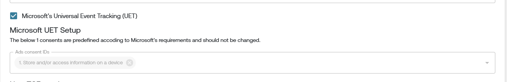

# Microsoft Consent Mode

## Enabling Microsoft Consent Mode in Gravito TCF CMP

Gravito CMP supports two ways to enable Universal Consent Mode:

### 1. Using Configurator

1.  **Login** to the Gravito Admin Portal.
2.  Click on the **CMP** tab.
3.  Select the **TCF 2.2 CMP Configurator** from the option.
4.  On the CMP Config listing page, click the **New Configuration** button to create a new CMP config.
5.  Fill in the **basic information**, then click **Next** at the bottom-left corner.
6.  On the **TCF Settings** page:

    - **Tick the checkbox** labeled **"Microsoft's Universal Event Tracking (UET)"**.
    - This will open a section for **Microsoft UET Setup**.
      

#### Consent Mapping:

You’ll now see dropdowns to map category for : `ad_storage`

**Note:** The `ad_storage` signal mapping is predefined according to Microsoft's requirements and is common across both GCMv2 & UET.

You may continue filling out the other CMP configuration steps, or jump directly to the **"Deploy"** tab.

### 2. Without Configurator

1.  **Enable UET Mode**:  
    Add the `useUET` flag under the `settings` section of your configuration and set its value to `true`.

     <pre><code>
     "settings": {
         "useUET": true
         // ... other settings
     }
     </code></pre>

2.  Add `adsConsentId`

    You must also define the `adsConsentId` property in your configuration. This is required to map consent values for Microsoft UET. There are two cases:

    - **If Google Consent Mode is already configured**:

          The `adsConsentId` property will already be available in your config.

    - **If not configured**:

          Add the `adsConsentId` property under the `core` section of your config manually.

   

3.  Define `adsConsentId` 

    The `adsConsentId` should be an array of TCF Purpose IDs that will be mapped to advertising consent.

      Example:
      <pre><code>
      "core": {
          "adsConsentId": [1]
      }
      </code></pre>

      This example maps the consent value of **Purpose 1** (typically used for storing and accessing information) to UET consent.

4.  How Gravito CMP Handles UET Consent

    Once the above configuration is complete:

    - Microsoft UET mode is considered **enabled**.
    - Gravito CMP adds the corresponding ads consent value (`denied` or `granted`) to the global `uetq` window object.
    - By default, the value is `denied`.
    - After consent is obtained, the CMP updates the value based on the mapping defined in `adsConsentId`.

    Microsoft reads this value from the `uetq` object to determine whether tracking is allowed.

    Gravito CMP's follow the approach mentioned [Here](https://help.ads.microsoft.com/#apex/ads/en/60119/1-500)
