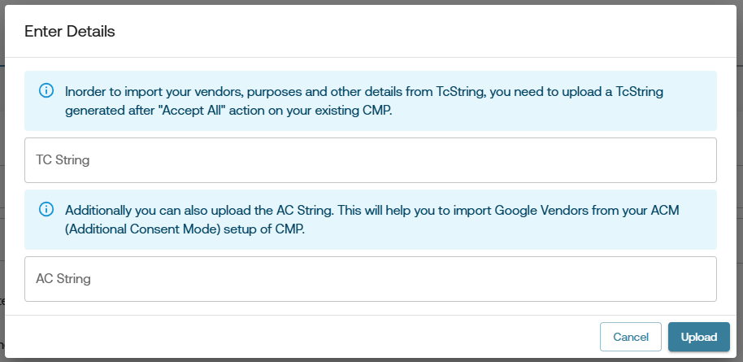

# TCF CMP Migration Guide

## Introduction

This guide provides a step-by-step explanation of the new feature in our CMP configurator tool that simplifies the migration process from other CMP providers to ours. Users can now import their existing configurations by pasting the TcString and/or AcString generated from their previous CMP after clicking on the "Accept All" action.

By doing so, the configurator can extract and pre-fill relevant details such as:

- Publisher Country Code
- Purpose One Treatment
- Vendors
- Special Features
- Purposes
- Publisher Restrictions
- ACM (Additional Consent Mode)
- Google Vendors

This feature minimizes the manual effort required to set up a new CMP configuration, ensuring a seamless transition.

## Step-by-Step Guide

### Step 1: Obtain TcString and AcString from Your Previous CMP

1. Go to your website where the existing CMP is live.

2. Click on the "Accept All" button of CMP.

3. Retrieve the generated TcString and/or AcString from the browser's cookies section in the developer tools.
   

### Step 2: Paste the Strings in the Configurator Tool

1. Open the Gravito's TCF CMP configurator and navigate to TCF setting section.

2. Find and click on the "Import Data" button on top-right corner of the configurator.
   

3. You will see fields labeled TcString and AcString.

4. Paste the TcString into the corresponding field.

5. (Optional) If available, paste the AcString into its respective field.
   

### Step 3: Upload and Extract Configuration

1. Click on the "Upload" button.

2. The system will process the provided TcString and AcString.

3. Upon successful extraction, relevant settings will be automatically populated in the configurator.
      

4. Review the extracted configuration and make necessary adjustments if required.

## Popular CMP Providers

The following table lists some popular CMP providers and details of their TcString & AcString. This information can be useful for users who want to identify the strings set by their previous CMP.

| CMP Provider | TcString Name               | AcString Name                | Location        |
| ------------ | --------------------------- | ---------------------------- | --------------- |
| OneTrust     | `eupubconsent-v2`           | ``                           | `Cookies`       |
| Sanoma       | `euconsent-v2`              | ``                           | `Cookies`       |
| Cookie Bot   | `cookiebotTcfConsentString` | `cookiebotGacmConsentString` | `Local Storage` |
