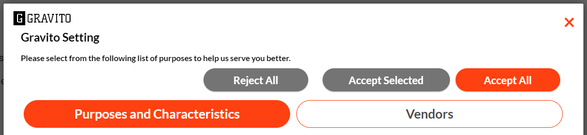
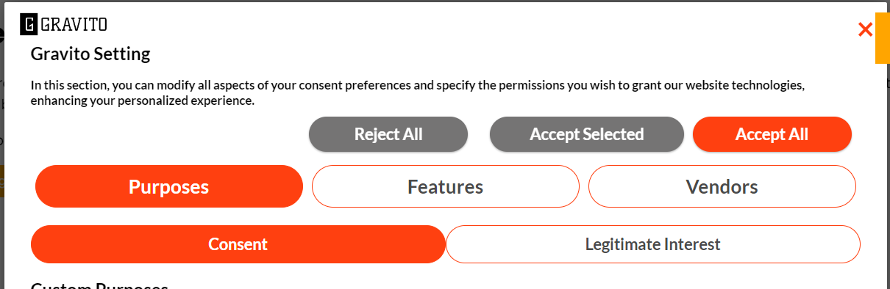
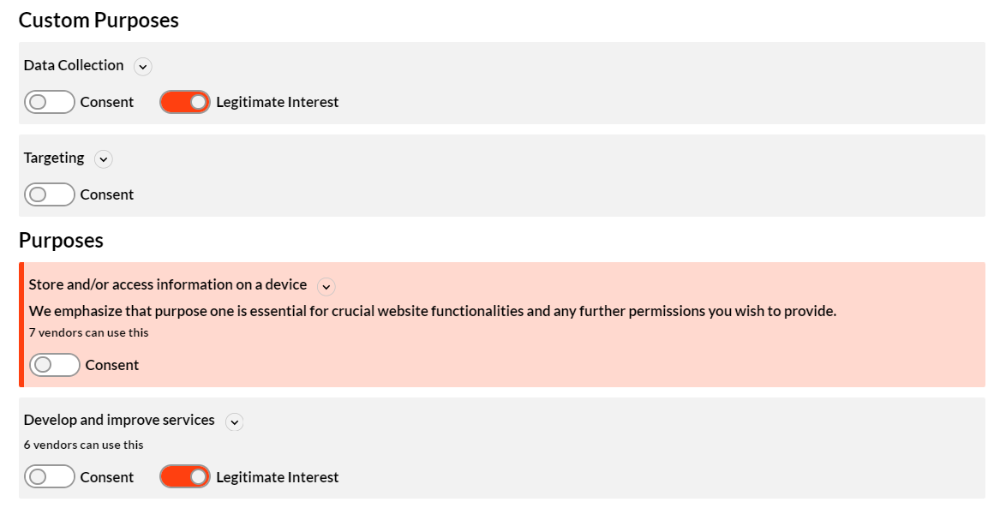
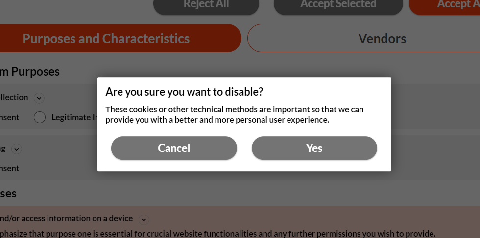
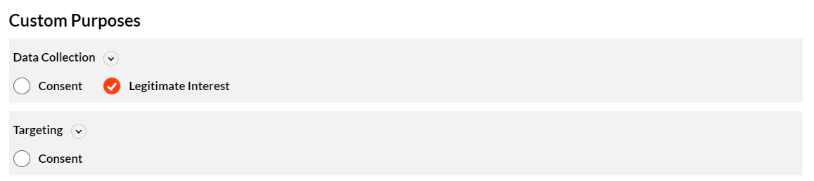

# TCF-CMP customizations

## Introduction

This document provides information on how to customize the TCF-CMP UI using the CMP config. The config is a JSON object that contains the configurations for the CMP. The config consist of 5 major section(settings, core, text, language, style) each of which handles different aspects of the CMP.

## Configurations

The following are the configurations that can be done in CMP config to achieve the desired customization.

<table>
    <tr>
        <th>Property Name</th>
        <th>Purpose</th>
        <th>Datatype</th>
        <th>Example</th>
    </tr>
    <tr>
        <td>core > highlightedTextForPurpose1</td>
        <td>to highlight first purpose</td>
        <td style="text-align: center;">Boolean</td>
        <td rowspan="4">
            
        </td>
    </tr>
    <tr>
        <td>text > secondLayer > highlightedTextForPurpose1</td>
        <td>Text to be displayed inside highlighted purpose</td>
        <td style="text-align: center;">String</td>
    </tr>
    <tr>
        <td>style > highlightColor</td>
        <td>color code for highlighting pupose 1</td>
        <td style="text-align: center;">Color HEX</td>
    </tr>
    <tr>
        <td>style > highlightBgColor</td>
        <td>color code to be used as background of highlighted purpose</td>
        <td style="text-align: center;">Color HEX</td>
    </tr>
    <tr>
        <td>style > buttonsOnTop</td>
        <td>to display action buttons above tabs in 2nd layer</td>
        <td style="text-align: center;">Boolean</td>
        <td>
            
        </td>
    </tr>
    <tr>
        <td>style > layoutType</td>
        <td>to choose between 2 tab layout or 3 tab layout</td>
        <td style="text-align: center;">select</td>
        <td>
            
        </td>
    </tr>
    <tr>
        <td>style > consentInputType</td>
        <td>to choose between toogle or checkbox input for consents</td>
        <td style="text-align: center;">select</td>
        <td>
            
        </td>
    </tr>
    <tr>
        <td>style > disableConfirmationModal</td>
        <td>to enable/disable the confirmation modal</td>
        <td style="text-align: center;">Boolean</td>
        <td>
            
        </td>
    </tr>
    <tr>
        <td>style > useAccordionForPurpose</td>
        <td>to enable/disable the confirmation modal</td>
        <td style="text-align: center;">Boolean</td>
        <td>
            
        </td>
    </tr>
</table>

## CSS Customization

CSS customization can be done by adding the custom CSS in the `style` section of the CMP config. The following are the CSS classes that can be used to customize the CMP.

<table>
    <tr>
        <th>Class Name</th>
        <th>Purpose</th>
    </tr>
    <tr>
        <td>.gravitoCMP-modal--layer1</td>
        <td>to customize the CMP layer-1 container</td>
    </tr>
    <tr>
        <td>.gravitoCMP-header-logo-div</td>
        <td>to customize the CMP header logo</td>
    </tr>
    <tr>
        <td>.gravitoCMP-content--layer1</td>
        <td>to customize the CMP layer-1 content & order</td>
    </tr>
    <tr>
        <td>.gravitoCMP-footer</td>
        <td>to customize the CMP layer-1 footer</td>
    </tr>
    <tr>
        <td>.gravitoCMP-layer-heading</td>
        <td>to customize the CMP layer heading</td>
    </tr>
    <tr>
        <td>.gravitoCMP-paragraph</td>
        <td>to customize the discritpion text</td>
    </tr>
    <tr>
        <td>.gravitoCMP-privacy</td>
        <td>to customize the privacy policy link</td>
    </tr>
    <tr>
        <td>.gravitoCMP-button</td>
        <td>to customize the CMP buttons</td>
    </tr>
</table>

<!-- Modal HTML -->

  &times;
  
  

