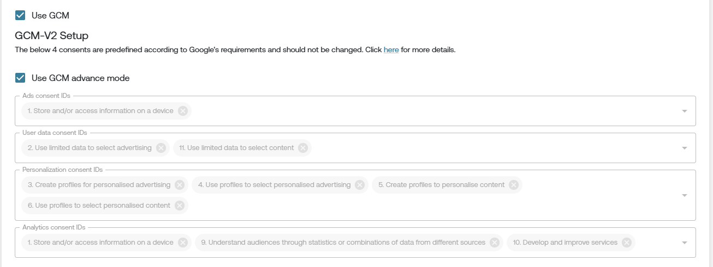
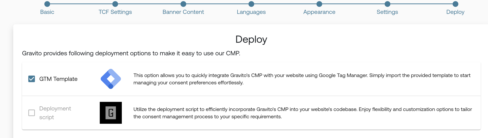
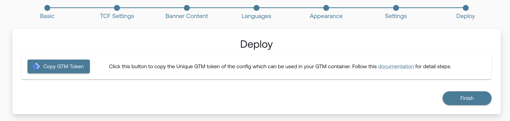
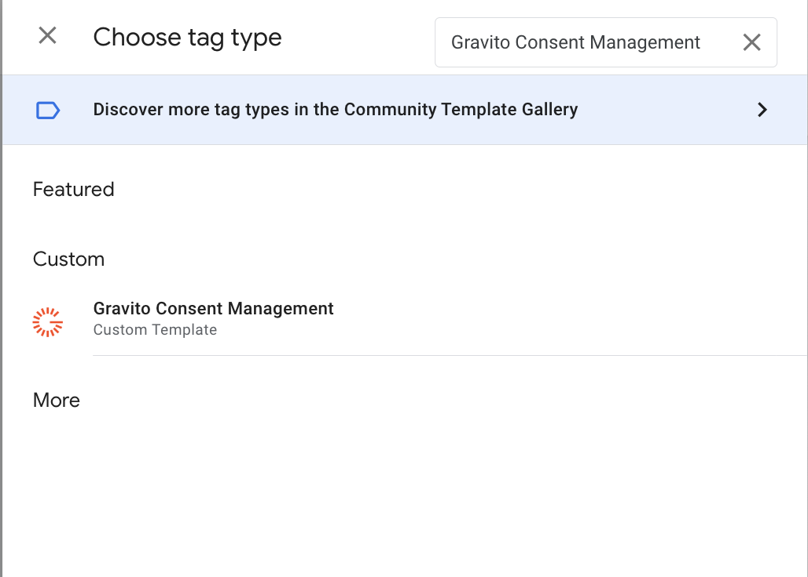
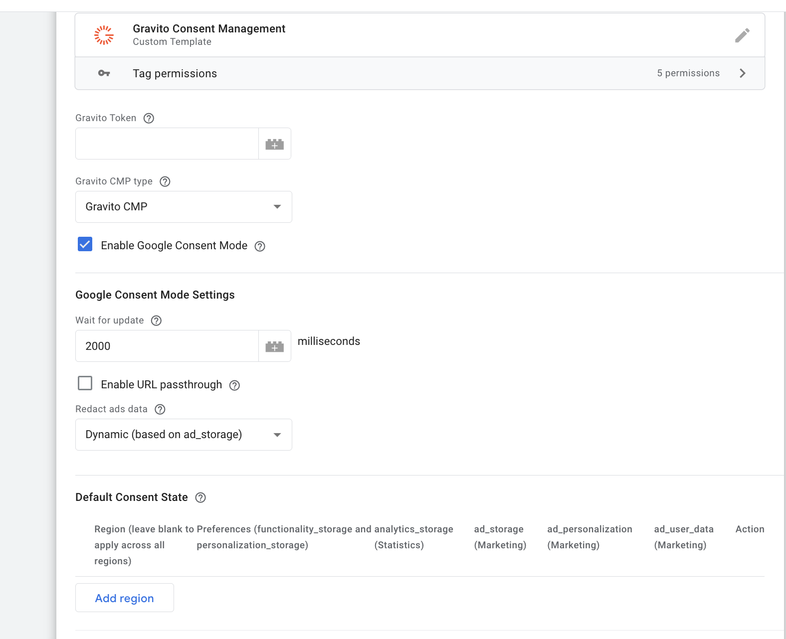
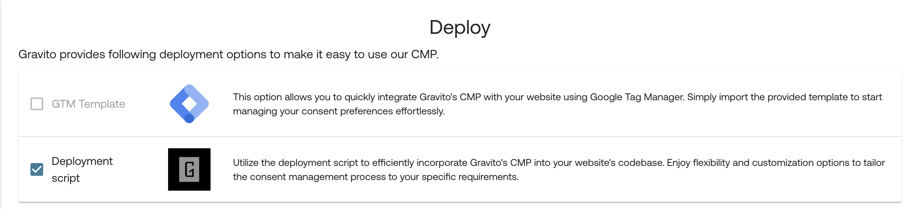
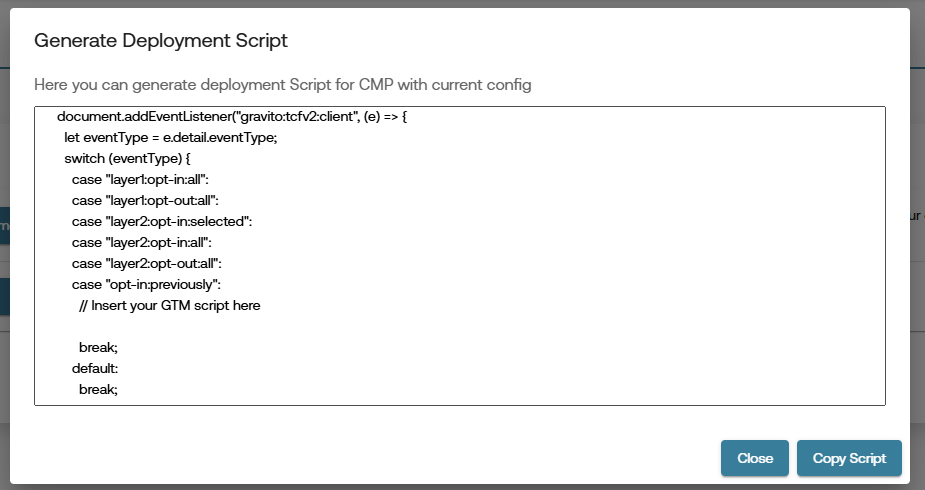

# Google Consent Mode v2

## What is Google Consent Mode v2?

**Google Consent Mode v2** allows you to adjust how Google tags behave based on the user's consent choices. This helps ensure compliance with data protection regulations while still enabling important site functionality.

Consent Mode v2 particularly impacts:

- **Cookies**
- **Ad Personalization**
- **Analytics Tracking**

With **Consent Mode v2**, Google introduced two **new consent signals** required to comply with the **EU Digital Markets Act (DMA)**:

### ✅ Consent Signals:
- `ad_storage`
- `analytics_storage`
- `ad_user_data` (🆕)
- `ad_personalization` (🆕)

> The new signals `ad_user_data` and `ad_personalization` are essential under DMA for platforms like Google Ads and should be set according to user consent.

**[Official Google Documentation on Consent Mode v2](https://developers.google.com/tag-platform/devguides/consent)**

---

## Enabling Google Consent Mode v2 in Gravito CMP

### Creating Config in Admin Portal
- **Login** to the Gravito Admin Portal.
- Click on the **CMP** tab.
- Select the **TCF 2.2 CMP Configurator** from the option.
- On the CMP Config listing page, click the **"New Configuration"** button to create a new CMP Config.
- Fill in the **basic information**, then click **Next** at the bottom-left corner.
- On the **TCF Settings** Tab:
  - **Tick the checkbox** labeled **Use GCM**.
  - This will enable the GCMv2 for your CMP config

    

   - **Use GCM Advance Mode** is enabled by default. You can uncheck this if you want to use the **Basic Mode**.

**Note:** when the using GCM Basic Mode, the **GTM template** deployment option will not be available.

#### Consent Mapping:

You’ll now see default mapping for the following Google consent signals:
- `ad_storage`
- `analytics_storage`
- `ad_user_data`
- `ad_personalization`


You may continue filling out the other CMP configuration steps, or jump directly to the **"Deploy"** tab.

---

Gravito TCF 2.2 CMP supports two ways to enable Consent Mode v2:

---

### 1. With GTM Template

- In the **Deploy** tab, you’ll see multiple deployment options.
- Click on the **"GTM Template"** option.
- Click **"Publish"**.

   

   > **Note:** When you click **Publish**, the system will validate all required fields. If anything is missing, it will display an error.  
   Once the config is published, you’ll be provided with a button labeled **"Copy GTM Token"**. Clicking this will copy the GTM token to your clipboard. We will use this token in the GTM template.

   

- **Login** to your **Google Tag Manager** account and click on a new **Tag**.

#### Tag Configuration:
- Choose the **Gravito Consent Management** template from the list.

   

#### Fill the fields:

| Field                          | Description                                                                 |
|--------------------------------|-----------------------------------------------------------------------------|
| **Gravito Token**              | Paste the **CMP token** copied from Gravito portal                          |
| **Gravito CMP type**           | Select **Gravito TCF CMP**              |
| ✅ **Enable Google Consent Mode** | Enable this to activate GCM support                                       |

---

### Google Consent Mode Settings

| Option                     | Description                                                                 |
|----------------------------|-----------------------------------------------------------------------------|
| **Wait for update**        | Time to wait (in ms) for consent before proceeding (default: `2000`)        |
| **Enable URL passthrough** | Optional: Enable if you need to forward consent state via query params      |
| **Redact ads data**        | Set to **Dynamic (based on ad_storage)** for flexible ad personalization    |

---

### Default Consent State (Optional)

- Configure regional preferences if needed.
- You can **leave it blank** to apply globally.

   

### Add Trigger and Save

- Add a **Page View** or **All Pages** trigger to fire this tag on every page load.
- Click **Save**.

---

### Publish the GTM Container

- Submit and **Publish** the container.
- CMP will now load and handle consent dynamically on your site.

---

### 2. Without GTM Template

#### Deployment (Without Template):

- In the **Deploy** tab, you'll see multiple deployment options.
- Since we’re not using the GTM template, click on **"Deployment Script"**.
- Click **"Publish"**.

   

>**Note:** When you click **Publish**, the system will validate all required fields. If anything is missing, it will display an error.

Once the config is published, you’ll be provided with a **deployment script**, which you can embed directly in your webpage to activate Consent Mode v2.

>**Note:** If you are using **GCM Basic Mode**, you will see additional logic in you deployment script.
   

   below the comment `// Insert your GTM script here` you can add your GTM script. You can get the GTM script from your GTM account. It will look like this:
```js
(function (w, d, s, l, i) {
  w[l] = w[l] || [];
  w[l].push({ "gtm.start": new Date().getTime(), event: "gtm.js" });
  var f = d.getElementsByTagName(s)[0],
    j = d.createElement(s),
    dl = l != "dataLayer" ? "&l=" + l : "";
  j.async = true;
  j.src = "https://www.googletagmanager.com/gtm.js?id=" + i + dl;
  f.parentNode.insertBefore(j, f);
})(window, document, "script", "dataLayer", "{{Your_GTM_ID}}");
```