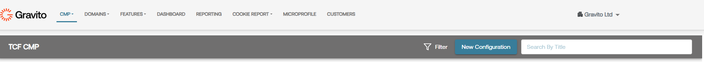

# Google Consent Mode V2 for TCF

Google's Consent Mode is a tool within Google Tag Manager that allows websites to adjust how tags behave based on user consent for tracking. It helps manage and control the behavior of tags, such as Google Analytics and Google Ads, depending on whether the user has provided consent for data collection and processing.

For detailed information and guidance on Google Consent Mode, refer to the official Google support documentation: [Google Consent Mode -- Official Documentation](https://support.google.com/analytics/answer/9976101?hl=en)

**Changes in Google Consent Mode v2**

In Consent Mode v2, Google introduced two additional consent types to offer users more granular control over their data sharing preferences:

- **ad_user_data:** This consent type pertains to user consent specifically for Google's advertising purposes. When a user actively agrees, typically through interaction with a consent banner, to share their data with Google for advertising purposes, the ad_user_data consent is set to 'granted.'
- **ad_personalization:** This consent type focuses on whether user data can be utilized for personalized advertising, such as remarketing or targeted ads. It requires explicit user agreement, typically through a consent banner interaction, to share their data with Google for ad personalization.

These additional consent types provide users with clearer choices and control over data sharing for advertising purposes, aligning with evolving privacy regulations and user expectations.

**Enabling Google Consent Mode v2 in New Configuration**

Gravito TCF CMP now supports Google Consent Mode v2, allowing you to integrate it into your configuration for enhanced user consent management. To use this feature in a new configuration, follow these steps:

1.  **Login to the Gravito Admin Portal:** Access the Gravito Admin Portal and navigate to the CMP tab. From the dropdown menu, select TCF 2.2 CMP Configurator.'

1.  **Creating a New Configuration:**
    - Click on "New Configuration" to initiate a new setup.
    - Fill in necessary details like configuration name and preferred language. Proceed by clicking 'Next.'

1.  **Settings Configuration:**

    - Configure preferences based on specific requirements in the settings section. Click 'Next' to proceed.

1.  **Core Configuration Tabs:**
    - Define consentable items, for your TCF CMP like purposes,special purposes , vendors, special features etc.
    - Enable Google Consent Mode (GCM) by checking the 'useGCM' checkbox.

1.  **Configuration Customization and Publishing:**

    - Customize other sections as needed based on preferences.
    - Publish the configuration to generate a deployment script.

1.  **Implement Deployment Script on Website:**

    - Copy the generated script and integrate it into your website.

1.  **Verification:**
    - Confirm correct consent propagation by checking the dataLayer object on your website.

---

### **Enabling Google Consent Mode v2 in Existing Configuration** 

To enable Google Consent Mode v2 in an existing configuration within Gravito TCF CMP, follow these steps:

1.  **Access the Gravito Admin Portal:** Log in to the Gravito Admin Portal and navigate to the CMP tab. Select TCF 2.2 CMP Configurator option.

1.  **Copying an Existing Configuration:**

    - Click the 'Copy From' button in front of the desired configuration.

1.  **Modifying Copied Configuration:**

    - Follow similar steps as the new configuration for settings, core tabs, consent able items, and customization options. Maintain consistency with the original configuration.

1.  **Enabling Google Consent Mode (GCM):**

    - Check the 'useGCM' checkbox in settings.
    - This will open Additional section which you can use to map google specified consents to IAB purposes.
    - For each google consent select purposes from the dropdown list to which you want to map that specific consents.
    - Also make sure that you have configured "googleTCFId" field correctly.

1.  **Finalizing Configuration and Publishing:**

    - Complete modifications and configurations.
    - Publish the modified configuration to generate a deployment script.

1.  **Implementing Updated Deployment Script:**

    - Integrate the updated script into your website.

1.  **Verification:**
    - Confirm correct consent propagation by examining the dataLayer object on your website.
