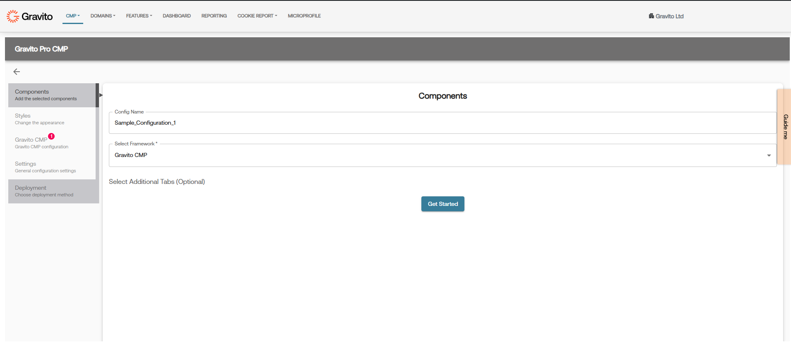
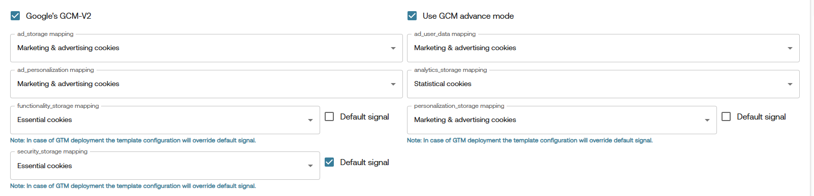
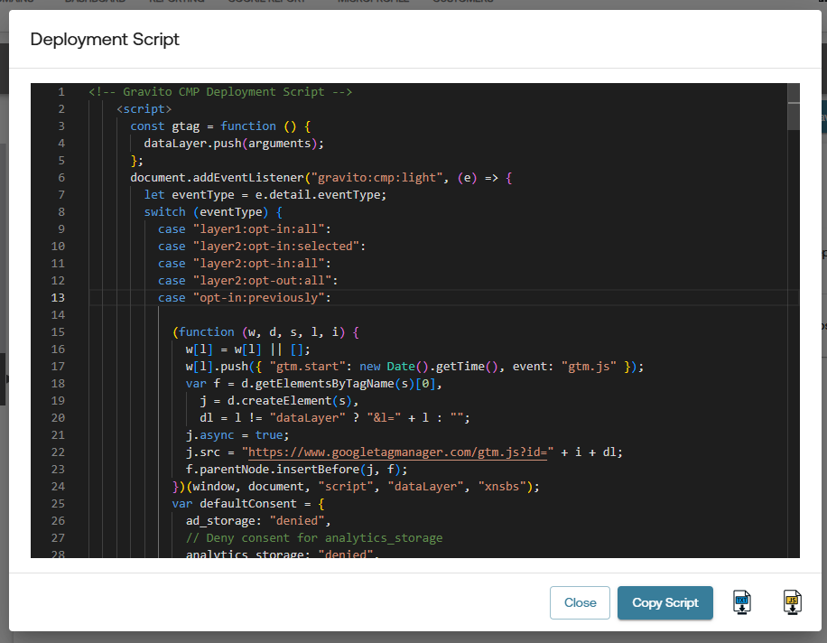

# Google Consent Mode v2

## What is Google Consent Mode v2?

**Google Consent Mode v2** allows you to adjust how Google tags behave based on the user's consent choices. Gravito CMP collects and stores user consent and integrates with Google Consent Mode to share that status with Google. When consent is limited or denied, Google tags adjust accordingly (e.g., restricted storage or other consent-aware behavior). Consent Mode is not a banner and not a legal compliance solution; it operates in tandem with our CMP; you remain responsible for obtaining any required consents.

Consent Mode v2 particularly impacts:

- **Cookies**
- **Ad Personalization**
- **Analytics Tracking**

With **Consent Mode v2**, Google introduced two **new consent signals** required to comply with the **EU Digital Markets Act (DMA)**:

### Consent Signals:
- `ad_storage`
- `analytics_storage`
- `ad_user_data` (🆕)
- `ad_personalization` (🆕)
- `functionality_storage`
- `personalization_storage`
- `security_storage`

> The new signals `ad_user_data` and `ad_personalization` are essential under DMA for platforms like Google Ads and should be set according to user consent.

**Note:** The `functionality_storage`, `personalization_storage`, and `security_storage` signals can only be set to `granted` or `denied`.

**[Official Google Documentation on Consent Mode v2](https://developers.google.com/tag-platform/devguides/consent)**

---

## Enabling Google Consent Mode v2 in Gravito CMP (New)

### Creating Config in Admin Portal

1. **Login** to the Gravito Admin Portal.
2. Click on the **CMP** tab.
3. Select the **Gravito CMP (New) Configurator** from the options.
4. On the CMP Config listing page, click the **New Configuration** button to create a new CMP Config.
5. Give the config an appropriate name and choose **Standard CMP** as the **Framework**. After that, click **Get Started** to proceed.
    
    

6. Now navigate to the **Standard CMP** tab and **Consent Categories** sub-tab for GCMv2-related setup.
7. You can enable GCM by selecting the checkbox labeled **Google's GCM-V2**.
8. After enabling GCM, some additional fields will appear for configuration.
    
    

    - **Use GCM Advanced Mode** is enabled by default. You can uncheck this if you want to use the **Basic Mode**.
    - All other fields are related to Google consent signal mapping. They are explained below.

**Note:** When using GCM Basic Mode, the **GTM template** deployment option will not be available.

#### Consent Mapping:

You’ll now see dropdowns to map categories for the following Google consent signals:
- `ad_storage`
- `analytics_storage`
- `ad_user_data`
- `ad_personalization`

For each of these, select the relevant **consent category** from the dropdown list. You will see default mappings, but you can change them as per your requirements.

Once mappings are complete, you may continue filling out the other CMP configuration steps or jump directly to the **Deployment** tab for publishing your config.

> **Note:** If you are using **GCM Basic Mode**, you will see additional logic in your deployment script.

   

   Below the comment `// Insert your GTM script here`, you can add your GTM script. You can get the GTM script from your GTM account. It will look like this:

```js
(function (w, d, s, l, i) {
  w[l] = w[l] || [];
  w[l].push({ "gtm.start": new Date().getTime(), event: "gtm.js" });
  var f = d.getElementsByTagName(s)[0],
    j = d.createElement(s),
    dl = l != "dataLayer" ? "&l=" + l : "";
  j.async = true;
  j.src = "https://www.googletagmanager.com/gtm.js?id=" + i + dl;
  f.parentNode.insertBefore(j, f);
})(window, document, "script", "dataLayer", "{{Your_GTM_ID}}");
```

### Custom Events in dataLayer

Gravito SDK as well as the GTM template will automatically push custom events to the `dataLayer` based on user consent choices. These events can be used to trigger specific tags in Google Tag Manager.

The following events are pushed by Gravito for consent updates:

- **gravitoGCMConsents**:
  This event is triggered when there is an update in the Gravito Consent Management (GCM) consents. It pushes the current consent states as an object, which can be used for conditional tag firing in GTM.

  ```javascript
  dataLayer.push({
    event: "gravitoGCMConsents",
    consents: consents,  // Object containing the user's consent states
  });
  ```


These events enable granular control over tag firing based on user consent preferences, ensuring compliance with privacy regulations and enhancing data governance within GTM.

You can listen for these events inside GTM and create triggers that activate tags only when the required consent conditions are met.
