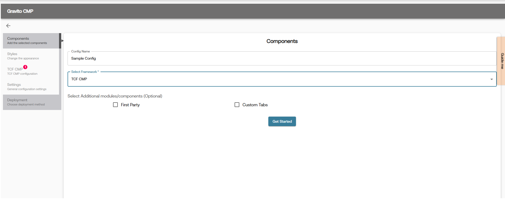

# Gravito CMP (New) - TCF CMP Component


## What is TCF CMP?
It is a TCF 2.2 compliant consent management platform component. It is used to collect consent for TCF 2.2 purposes, special features, and vendors. It is a full-fledged CMP that can be used for any website. It can be used for GDPR compliance.

This will be port of Gravito TCF 2.2 CMP which is also listed as one of the [Google Certified TCF CMP's](https://support.google.com/admanager/answer/13554116?hl=en#zippy=%2Cgoogle-certified-cmps) (*Web and App*)

## How to use TCF CMP Component in Gravito CMP (New)?
You can use the TCF CMP component in your Gravito CMP (New) while setting up your configuration. In Gravito CMP (New) Configurator's components tab, choose the **TCF CMP** component and then configure it as per your requirement.

  

## How to setup TCF CMP Component?
TCF CMP setup can be done using Gravito CMP (New) Configurator on Gravito’s Admin Portal.
Once you have selected the TCF CMP component in the configurator, it will add the TCF CMP tab in the left sidebar of the configurator. Click on it to open the TCF CMP-specific configurator area.


In this section, you will find the following tabs:

- **TCF Settings**: This tab is used to configure the consent-based settings. Here, you can configure the consentable items mentioned in the TCFv2.2 framework such as TCF vendors, purposes, special purposes, features, special features, enable/disable various integrations such as Google Consent Mode, Microsoft UET, etc., as well as adjust some advanced settings.
> **Note**: Details on how to integrate with Google Consent Mode and Microsoft UET are already covered in the [Gravito TCF CMP UET](./tcf_cmp_uet.md) and [Gravito TCF CMP GCM](./tcf_cmp_gcmv2.md) documentation.

- **Languages**: This tab is used to configure the languages for the CMP. You can add multiple languages and configure the text for each language.

- **Appearance**: This tab is used to configure the appearance of the CMP. In this tab, you can override the default styles of the CMP and configure the styles (CSS classes) as per your requirement.
In the provided code editor on this tab, you can add the CSS classes to override the default styles of the CMP.
Additionally, you can also choose the type of consent input controls you want to use in the CMP. You can choose between **Checkbox** and **Toggle**. The default value is **Checkbox**.
> **Note**: Whatever CSS classes you add in this tab will be added as a separate stylesheet in the head of the page. So you can basically add any CSS syntax in this editor.

Help content for each field is provided in the configurator itself. You can hover over each field to see the help content.

## Event & Integration

TCF CMP Component, when used with PRO CMP, dispatches various events in its lifecycle. All these events are dispatched under the common namespace of `gravito:tcfv2:client`. You can listen to these events on your website and take the required action.

To listen to these events, use the following code:
```javascript
window.addEventListener('gravito:tcfv2:client', function (event) {
      let eventType = event.detail.eventType;
        // your code here
});
``` 
TCF Component exposes a current state of consent in window scope object. You can access the current state of consent using `gravito.cmp.tcf.currentState`. This object will have consent values for all the purposes, special features, and vendors used by CMP.

```javascript

let currentState = gravito.cmp.tcf.currentState
// Current state will have the following structure:
// {
//     "whiteListVendors": {
//         "consent": {
//             "2": true,
//             "6": true,
//             "8": true,
//             "11": true,
//             "14": true,
//             "278": false,
//             "511": true,
//             "755": true
//         },
//         "legitimateInterests": {
//             "2": true,
//             "6": true,
//             "8": true,
//             "11": true,
//             "14": true,
//             "278": true,
//             "511": true,
//             "755": true
//         }
//     },
//     "purposes": {
//         "consent": {
//             "1": true,
//             "2": true,
//             "3": true,
//             "4": true,
//             "5": true,
//             "6": true,
//             "7": true,
//             "8": true,
//             "9": true,
//             "10": true,
//             "11": true
//         },
//         "legitimateInterests": {
//             "1": false,
//             "2": true,
//             "3": false,
//             "4": false,
//             "5": false,
//             "6": false,
//             "7": true,
//             "8": true,
//             "9": true,
//             "10": true,
//             "11": true
//         }
//     },
//     "specialFeatures": {
//         "1": true,
//         "2": true
//     },
//     "customPurposes": {
//         "consent": {
//             "1": true,
//             "2": true
//         },
//         "legitimateInterests": {
//             "1": true,
//             "2": false
//         }
//     },
//     "nonTCFVendors": [
//         {
//             "id": 1,
//             "name": "Facebook",
//             "consent": true
//         },
//         {
//             "id": 2,
//             "name": "Amazon",
//             "consent": false
//         }
//     ]
// }
  ;


```
>**Note**: The above object is just an example. The actual object will have the values based on the user's consent and your configuration.

You can use the above two code snippets to listen to events and get the current consent state of the CMP. 
For example, if you want to perform some action whenever a user gives/modifies consent, you can use the following code:
```javascript

window.addEventListener('gravito:tcfv2:client', function (event) {
      let eventType = event.detail.eventType;
      let consentUpdateEventsList = [
        "layer1:opt-out:all",
        "layer2:opt-out:all",
        "layer2:opt-in:selected",
        "layer1:opt-in:all",
        "layer2:opt-in:all",
        "opt-in:previously",
      ];
      if (consentUpdateEventsList.includes(eventType)) {
        // Get the current consent state
        let currentState = gravito.cmp.tcf.currentState;
        // Do your action here
      }
});
```

Below is the list of event types dispatched by the TCF CMP component:

| Event Name | Description |
|------------|-------------|
| layer1:opt-out:all | This event is dispatched when a user opts out of all categories in layer 1 (Declaration Tab), i.e., clicked on the Reject All button on layer 1. |
| layer2:opt-out:all | This event is dispatched when a user opts out of all categories in layer 2 (Details Tab), i.e., clicked on the Reject All button on layer 2. |
| layer2:opt-in:selected | This event is dispatched when a user opts in to selected categories in layer 2 (Details Tab), i.e., clicked on the Accept Selected button. |
| layer1:opt-in:all | This event is dispatched when a user opts in to all categories in layer 1 (Declaration Tab), i.e., clicked on the Accept All button. |
| layer2:opt-in:all | This event is dispatched when a user opts in to all categories in layer 2 (Details Tab), i.e., clicked on the Accept All button. |
| layer1:settings | This event is dispatched when a user clicks the settings button on layer 1. |
| opt-in:previously | This event is dispatched when the user has already given consent and a consent cookie is present in the browser. |
| opt-in:previously:outdated | This event is dispatched when the user has already given consent but the consent cookie is outdated. |
| cmploaded | This event is dispatched when the CMP is loaded and ready to use. |
| ui-shown | This event is dispatched when the CMP UI is shown to the user. |
| gcm:default | This event is dispatched when the GCM default event is added to the dataLayer. This is specific to GCMv2 integration and will not fire if GCMv2 is not enabled or if using a GTM Template. |

# FAQ's

- [How to Resurface the CMP UI to All users and Collect Consent Again?](../../FAQ/How_to_resurface_ProCMP.md)

- [How to use your custom font in CMP?](../../FAQ/How_to_addCustomFonts.md)
- [How to Provide Google with the Required Legititimate Interest's Even on Reject All Action?](../../FAQ/How_to_be_google_complaint.md)