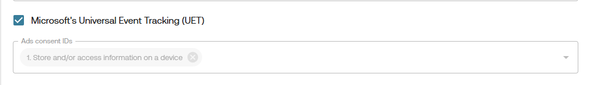

# Microsoft Consent Mode (UET)

## Enabling Microsoft Consent Mode in Gravito CMP (New) - TCF Component

 TCF CMP Component supports two ways to enable Microsoft's Universal Consent Mode:

### 1. Using Configurator

1. **Login** to the Gravito Admin Portal.
2. Click on the **CMP** tab.
3. Select the **Gravito CMP (New) Configurator** from the option.
4. On the CMP Config listing page, click the **New Configuration** button to create a new CMP config.
5. Give config an appropriate name and choose **TCF CMP** as **Framework**. After that, click **Get Started** to proceed.
        

6. Now navigate to **TCF CMP** tab and **TCF Settings** sub-tab for UET related setup.
7. You can enable UET by checking the checkbox labeled **Microsoft's Universal Event Tracking (UET)**.
8. After enabling UET, an additional field will appear for configuration.
    

#### Microsoft's Consent Signal Mapping:

You’ll now see default mapping for the consent signal : `ad_storage`

The signal is pre-mapped to the TCF purposes based on Microsoft's requirements and should not be changed.

**Note:** This mapping for the `ad_storage` signal is common across both GCMv2 & UET.

You may continue filling out the other CMP configuration steps, or jump directly to the **Deployment** tab for publishing your config.

### 2. Without Configurator

1.  **Enable UET Mode**:  
    Add the `useUET` flag under the `window.gravito.config.cmp.tcf.core` section of your configuration and set its value to `true`.

     <pre><code>
        window.gravito = {
            config: {
                cmp: {
                    tcf: {
                        core: {
                            useUET: true,
                                 // ... other configurations
                        }
                    }
                }
            }
        };  
     </code></pre>

2.  Add `adsConsentId`

    You must also define the `adsConsentId` property in your configuration. This is required to map consent values for Microsoft UET. There are two cases:

    - **If Google Consent Mode is already configured**:

          The `adsConsentId` property will already be available in your config.

    - **If not configured**:

          Add the `adsConsentId` property under the `window.gravito.config.cmp.tcf.core` section of your config manually.

3.  Define `adsConsentId` Based on CMP Type

    The `adsConsentId` should be an **Array** containing the IDs of TCF Purposes. It's value should be set to `[1]`

      Example:
      <pre><code>
     window.gravito = {
         config: {
             cmp: {
                 tcf: {
                     core: {
                         adsConsentId: [1],
                             // ... other configurations
                     }
                 }
             }
         }
     };
      </code></pre>

    This example maps the consent value of **Purpose 1** (typically used for storing and accessing information) to UET consent.

4.  How Pro TCF CMP Handles UET Consent

    Once the above configuration is complete:

    - Microsoft UET mode is considered **enabled**.
    - Gravito CMP adds the corresponding ads consent value (`denied` or `granted`) to the global `uetq` window object.
    - By default, the value is `denied`.
    - After consent is obtained, the CMP updates the value based on the mapping defined in `adsConsentId`.

    Microsoft reads this value from the `uetq` object to determine whether tracking is allowed.

    Gravito CMP's follow the approach mentioned [Here](https://help.ads.microsoft.com/#apex/ads/en/60119/1-500)
