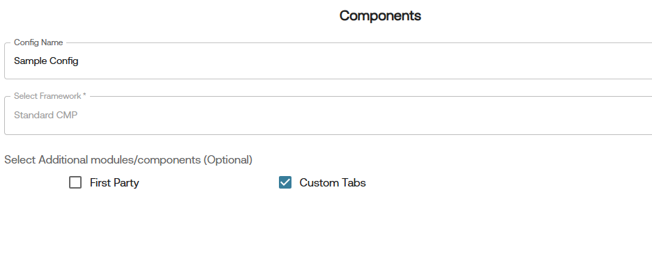
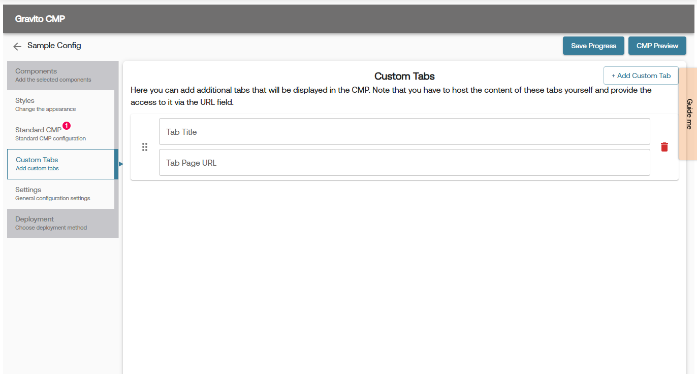

# Custom Tabs

Gravito CMP (New) allows you to create custom tabs for your CMP. This feature is useful for adding additional information or functionality to your CMP.

## Creating Custom Tabs
To add a custom tab to your CMP, follow these steps:

1. Check the **Custom Tabs** checkbox in the **Components** section of the configurator.
     
2. A new tab will appear in the configurator named **Custom Tabs**.
3. Click on the **Custom Tabs** tab where you can configure your custom tabs.
4. Click on the **Add Tab** button to create a new tab.
    
5. Enter the **Tab Title** and **Tab URL** in the provided fields.
6. You can also adjust the sequence of the tabs by dragging and dropping them in the list.
7. Once you have added all the required tabs, click **CMP Preview** to see the changes in the CMP preview.
8. Click **Save Progress** to save your changes.

>**Note**: You can either host a static HTML page and provide the URL or can provide a URL of a page from your website. The content of the tab will be loaded from the provided URL.