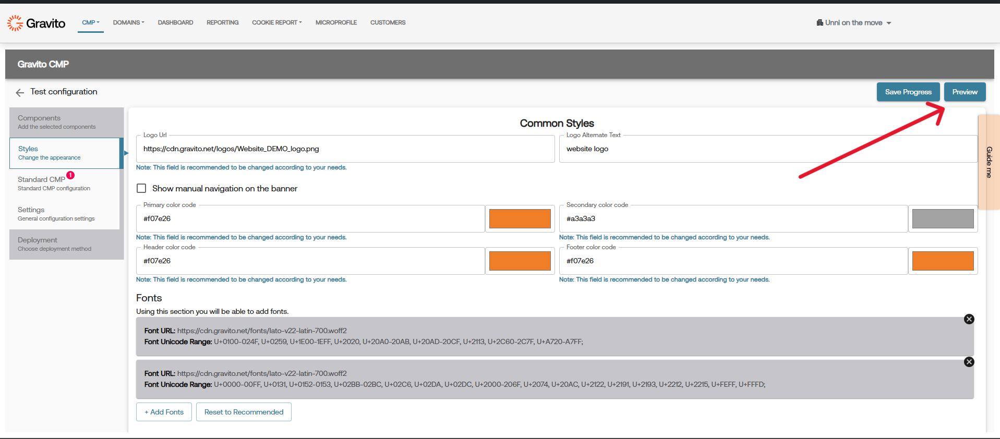
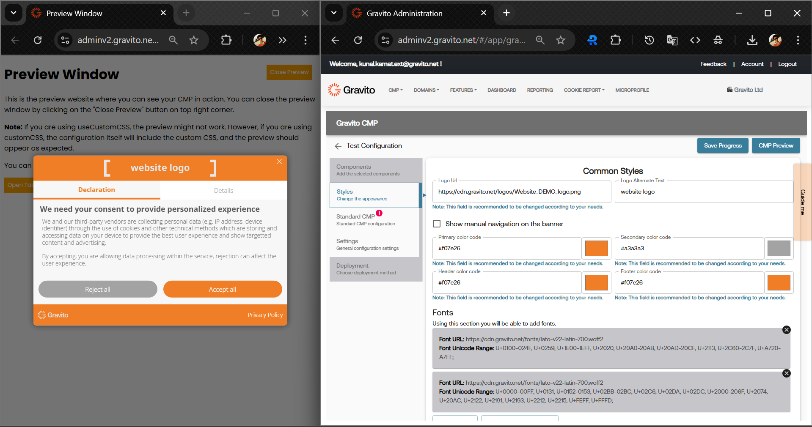

# CMP Preview

The CMP Preview feature in Gravito CMP Configurator allows you to see how your customized CMP banner will appear to end-users before deploying it live. This feature is essential for ensuring that all design elements, colors, fonts, logos and other configuration options are correctly implemented according to your branding guidelines.

## How to Use CMP Preview
1. **Access the CMP Configurator**: Navigate to the Gravito CMP Configurator and choose the configuration you want to edit or create a new one.
2. **Preview Button**: Look for the "Preview" button within the configurator interface. This button is typically located at the top right corner of the configurator.
    
3. **View the Preview**: Clicking the "Preview" button will open a new window with a live preview of your CMP banner. You can interact with the banner to see how it behaves with different user actions.
4. **Preview Window**: You an place the preview window however you find most convenient. We recommend placing the preview window side-by-side with the configurator to see changes in real-time as you make adjustments.
    
>**Pro Tip**: You can also use multi-monitor setups to have the configurator on one screen and the preview on another for better visibility.
5. **Make Customizations**: As you make changes in the configurator, the preview will automatically update to reflect those changes. This allows you to see how different configurations affect the appearance and functionality of the CMP banner.
6. **Debugging**: You can use the browser's developer tools to inspect elements, view GCM dataLayer events, check consent string in cookies, and debug any issues that may arise during the preview.

Note: If you encounter any issues with the preview not updating correctly, try refreshing the preview window or re-opening it from configurator.