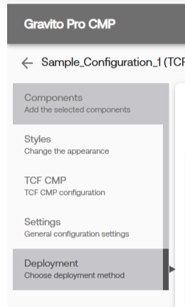
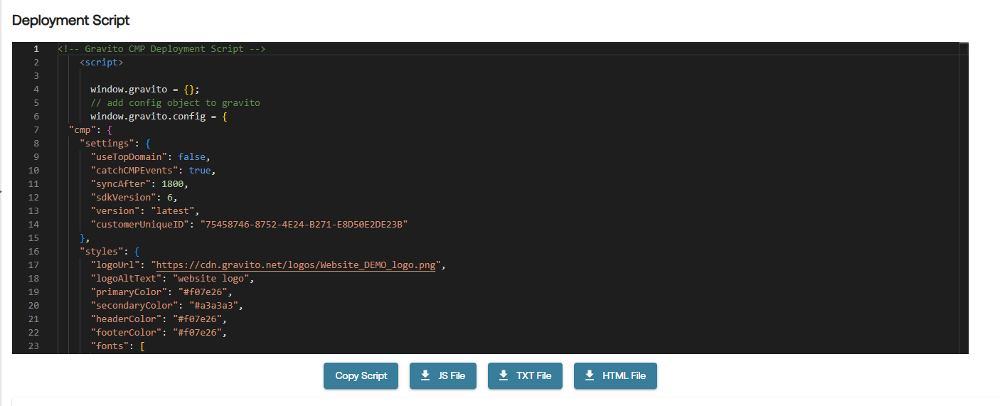
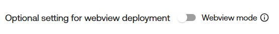
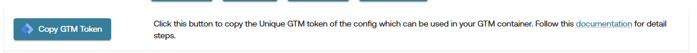
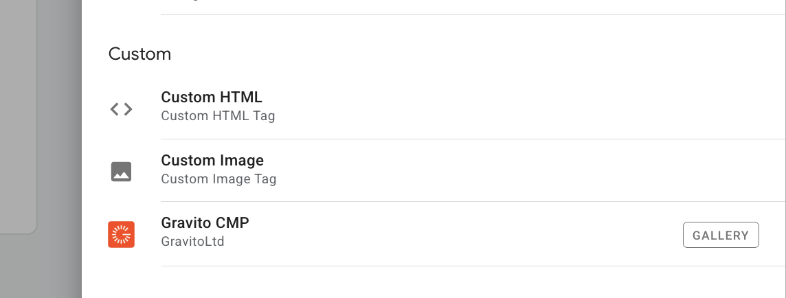
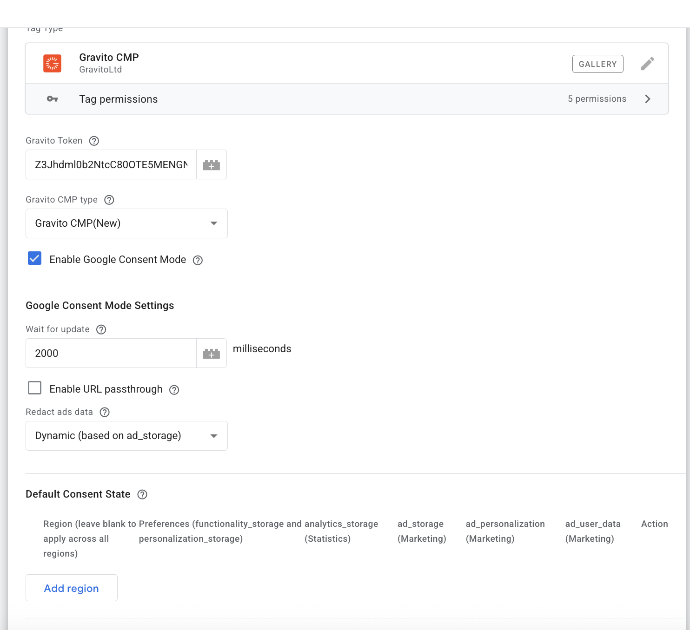
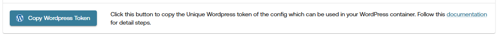

# Deployment for Gravito CMP (New) Configuration

All deployment related actions for Gravito CMP (New) are handled through **Deployment** tab in the Gravito CMP (New) Configurator. This tab is available as the last tab in the sidebar of the configurator.

After configuring your CMP, you can click the **Validate & Publish** button to publish your changes.

> **Note**: You cannot make changes to the CMP configuration after publishing. However, you can always create a copy of the configuration to make changes.

After Publishing, the below deployment methods are available:

## 1. Deployment Script
This option allows you to deploy Gravito CMP using a simple script. You can download the script in the format of your choice.

Now you can copy or download the deployment script using the options as shown in below image
     

> **Note**: If you want to deploy the CMP on a mobile application, please **enable** the [Webview Mode](./Components/TCFCMP/webview_cmp_for_apps.md) option in the Deployment tab.
        

**For Website** - You can paste the script directly into the `<head>` section of your website so that it loads before any other scripts. 

**For Mobile App** - You can download the script as a `HTML` file and use it in your mobile app's webview. This html file can be downloaded only when you enable the webview mode.

## 2. GTM (Google Tag Manager) Template
This option allows you to quickly integrate Gravito's CMP with your website using Google Tag Manager. Please follow the steps below to deploy using GTM:

1. You can copy the GTM Token by clicking on the **Copy GTM Token** button.

    

2. **Login** to your **Google Tag Manager** account and click on a new **Tag**.

    #### Tag Configuration:
    - Choose the **Gravito Consent Management** template from the list.

    

    #### Fill the fields:

    | Field                          | Description                                                                 |
    |--------------------------------|-----------------------------------------------------------------------------|
    | **Gravito Token**              | Paste the **CMP token** copied from Gravito portal                          |
    | **Gravito CMP type**           | Select **Gravito CMP (New)**              |
    | ✅ **Enable Google Consent Mode** | Enable this to activate GCM support                                       |

    ---

    ### Google Consent Mode Settings

    | Option                     | Description                                                                 |
    |----------------------------|-----------------------------------------------------------------------------|
    | **Wait for update**        | Time to wait (in ms) for consent before proceeding (default: `2000`)        |
    | **Enable URL passthrough** | Optional: Enable if you need to forward consent state via query params      |
    | **Redact ads data**        | Set to **Dynamic (based on ad_storage)** for flexible ad personalization    |

    ---

    ### Default Consent State (Optional)

    - Configure regional preferences if needed.
    - You can **leave it blank** to apply globally.

    

    ### Add Trigger and Save

    - Add a **Page View** or **All Pages** trigger to fire this tag on every page load.
    - Click **Save**.

    

    ### Publish the GTM Container

    - Submit and **Publish** the container.
    - CMP will now load and handle consent dynamically on your site.

## 3. WordPress Plugin
Seamlessly integrate Gravito's CMP into your WordPress website using our dedicated plugin. Please follow the steps below to deploy using the WordPress plugin:

1. You can copy the WordPress Token by clicking on the **Copy WordPress Token** button.

    

2. Use this token in the WordPress plugin to integrate Gravito's CMP into your website.