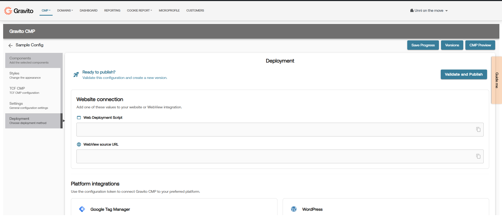
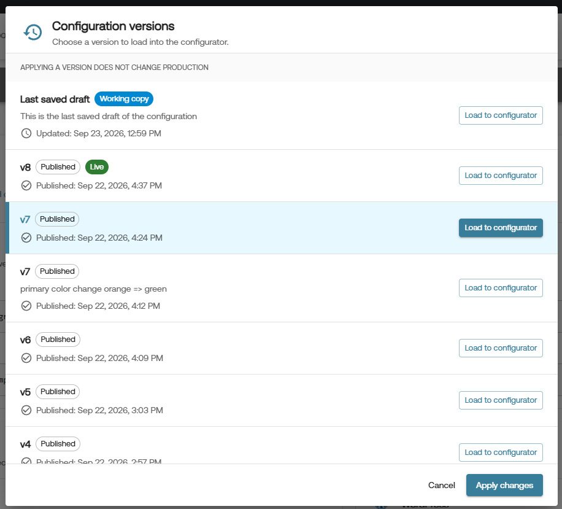
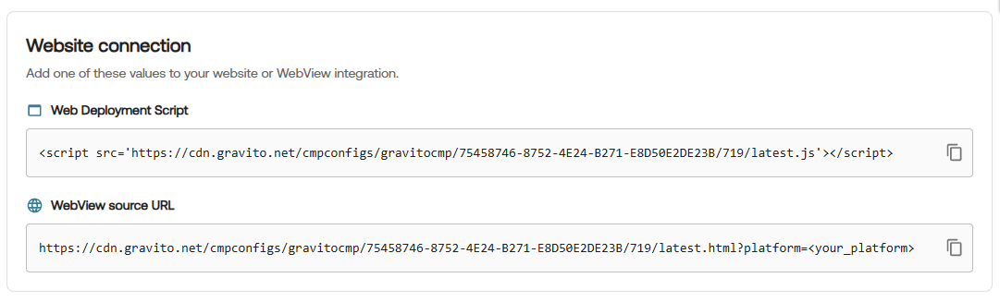
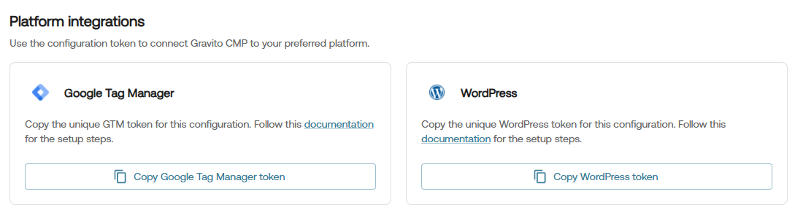
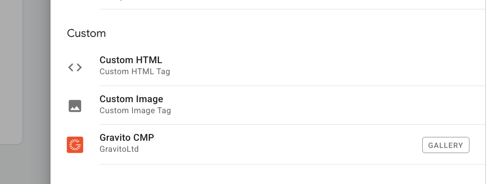
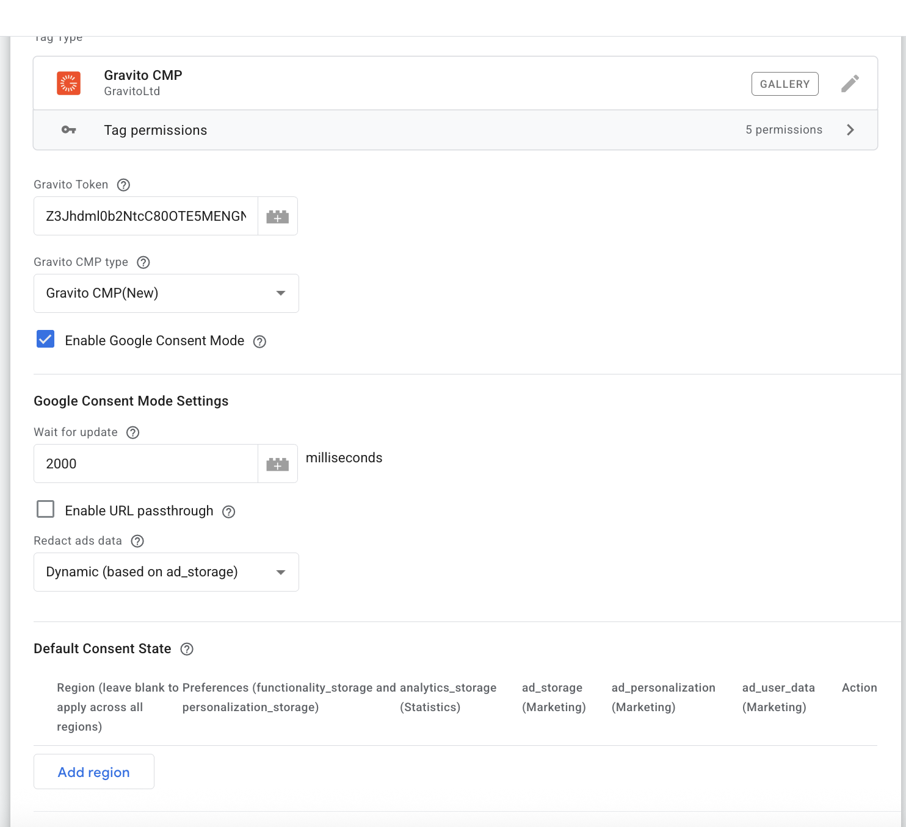

# Deployment for Gravito CMP (New) Configuration

All deployment-related actions for Gravito CMP (New) are handled through the **Deployment** tab in the Gravito CMP (New) Configurator. This tab is available as the last tab in the sidebar of the configurator.

## Publish a configuration

After configuring your CMP, click **Validate and Publish** to validate the configuration and create its first published version. During publishing, provide a version title and optional version notes so that the change can be identified later.

The deployment URL is stable. You add the deployment script to your website once, and subsequent published versions are served through the same URL. You do not need to replace the script on your website when you update the configuration.

After a configuration has been published, the Deployment tab shows **Validate and Republish**. To publish changes:

1. Update the configuration and click **Save Progress**.
2. Open the **Deployment** tab and click **Validate and Republish**.
3. Enter a version title and optional notes, then click **Publish**.

The new version becomes the live version at the existing deployment URL. The same behavior applies to the deployment script, WebView URL, GTM token, and WordPress token associated with the configuration.

## Manage versions and roll back

Click **Versions** in the configurator to view the saved draft and published versions. The version list indicates the currently live version and includes the publication date, title, and notes when provided.

To roll back to an earlier version:

1. Click **Versions**.
2. Find the version you want to restore and click **Load to configurator**.
3. Review the loaded configuration and make any required adjustments.
4. Click **Validate and Republish**, enter the version details, and publish it.

Loading a version into the configurator does not change production. The rollback takes effect only after you republish it. The deployment URL remains unchanged, so the website, WebView, and other integrations continue to use the same point of contact.

## Website connection

The **Website connection** section provides the values required to connect your website or WebView integration to Gravito CMP.

### Web Deployment Script

You can copy the **Web Deployment Script** and paste it into your website's HTML to load Gravito CMP. The script is a one-line snippet that loads the CMP asynchronously.

**For a website**: Paste the one-line script at the very top of the `<body>` section so it loads before other scripts.

### WebView source URL

Copy the **WebView source URL** and use it as the source URL when loading Gravito CMP in your mobile application's WebView.

For platform-specific WebView setup, including the required `platform` query parameter and message handling, see the [WebView-based CMP Integration Guide](./Components/TCFCMP/webview_cmp_for_apps.md).

## Platform integrations

Use the configuration token to connect Gravito CMP to your preferred platform.

### Google Tag Manager (GTM) Template

This option allows you to quickly integrate Gravito's CMP with your website using Google Tag Manager. Please follow the steps below to deploy using GTM:

1. You can copy the GTM Token by clicking on the **Copy GTM Token** button.

2. **Login** to your **Google Tag Manager** account and click on a new **Tag**.

    #### Tag Configuration:
    - Choose the **Gravito Consent Management** template from the list.

    

    #### Fill the fields:

    | Field                          | Description                                                                 |
    |--------------------------------|-----------------------------------------------------------------------------|
    | **Gravito Token**              | Paste the **CMP token** copied from Gravito portal                          |
    | **Gravito CMP type**           | Select **Gravito CMP (New)**              |
    | ✅ **Enable Google Consent Mode** | Enable this to activate GCM support                                       |

    ---

    ### Google Consent Mode Settings

    | Option                     | Description                                                                 |
    |----------------------------|-----------------------------------------------------------------------------|
    | **Wait for update**        | Time to wait (in ms) for consent before proceeding (default: `2000`)        |
    | **Enable URL passthrough** | Optional: Enable if you need to forward consent state via query params      |
    | **Redact ads data**        | Set to **Dynamic (based on ad_storage)** for flexible ad personalization    |

    ---

    ### Default Consent State (Optional)

    - Configure regional preferences if needed.
    - You can **leave it blank** to apply globally.

    

    ### Add Trigger and Save

    - Add a **Page View** or **All Pages** trigger to fire this tag on every page load.
    - Click **Save**.

    

    ### Publish the GTM Container

    - Submit and **Publish** the container.
    - CMP will now load and handle consent dynamically on your site.

### WordPress Plugin

Seamlessly integrate Gravito's CMP into your WordPress website using our dedicated plugin. Please follow the steps below to deploy using the WordPress plugin:

1. You can copy the WordPress Token by clicking on the **Copy WordPress Token** button.

2. Use this token in the WordPress plugin to integrate Gravito's CMP into your website.