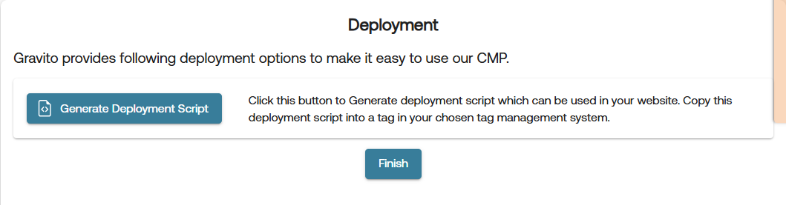

# Deployment for Gravito CMP (New) Configuration

Gravito CMP can be deployed in the following ways. 

 1. GTM (Google Tag Manager) Template
 2. WordPress Plugin
 3. Deployment Script
 4. [Webview for Mobile implementations](./Components/TCFCMP/webview_cmp_for_apps.md) (TCF CMP)

All deployment related actions for Gravito CMP (New) are handled through **Deployment** tab in the Gravito CMP (New) Configurator. This tab is available as the last tab in the sidebar of the configurator.

Gravito CMP (New) supports multiple deployment options to suit different environments and use cases. Below are the available deployment methods:

## 1.  [GTM (Google Tag Manager) Template](#gtm)
This option allows you to quickly integrate Gravito's CMP with your website using Google Tag Manager. Please follow the steps below to deploy using GTM:

1. Select the **GTM Template** option from the provided **Deployment Method** and click **Validate & Publish** button.

    

2. if the validation and publishing is successful, you will get an option to copy GTM Token by clicking on the **Copy GTM Token** button.

    

3. **Login** to your **Google Tag Manager** account and click on a new **Tag**.

    #### Tag Configuration:
    - Choose the **Gravito Consent Management** template from the list.

    

    #### Fill the fields:

    | Field                          | Description                                                                 |
    |--------------------------------|-----------------------------------------------------------------------------|
    | **Gravito Token**              | Paste the **CMP token** copied from Gravito portal                          |
    | **Gravito CMP type**           | Select **Gravito CMP (New)**              |
    | ✅ **Enable Google Consent Mode** | Enable this to activate GCM support                                       |

    ---

    ### Google Consent Mode Settings

    | Option                     | Description                                                                 |
    |----------------------------|-----------------------------------------------------------------------------|
    | **Wait for update**        | Time to wait (in ms) for consent before proceeding (default: `2000`)        |
    | **Enable URL passthrough** | Optional: Enable if you need to forward consent state via query params      |
    | **Redact ads data**        | Set to **Dynamic (based on ad_storage)** for flexible ad personalization    |

    ---

    ### Default Consent State (Optional)

    - Configure regional preferences if needed.
    - You can **leave it blank** to apply globally.

    

    ### Add Trigger and Save

    - Add a **Page View** or **All Pages** trigger to fire this tag on every page load.
    - Click **Save**.

    

    ### Publish the GTM Container

    - Submit and **Publish** the container.
    - CMP will now load and handle consent dynamically on your site.

## 2. [WordPress Plugin](#wp)
Seamlessly integrate Gravito's CMP into your WordPress website using our dedicated plugin. Please follow the steps below to deploy using the WordPress plugin:

1. Select the **WordPress Plugin** option from the provided **Deployment Method** and click **Validate & Publish** button.

    

2. if the validation and publishing is successful, you will get an option to copy WordPress Token by clicking on the **Copy WordPress Token** button.

    

3. Use this token in the WordPress plugin to integrate Gravito's CMP into your website.

## 3. Deployment Script:
Utilize the deployment script to efficiently incorporate Gravito's CMP into your website's codebase. Please follow the steps below to deploy using the deployment script:

1. Select the **Deployment Script** option from the provided **Deployment Method** and click **Validate & Publish** button.

    

2. if the validation and publishing is successful, you will get an option to **Generate Deployment Script** and **Download Config**.

    

3. Click on the **Generate Deployment Script** button to generate the deployment script. This will open a modal with the generated script as shown in below image. You can paste this script in your website's `<body>` tag.

    