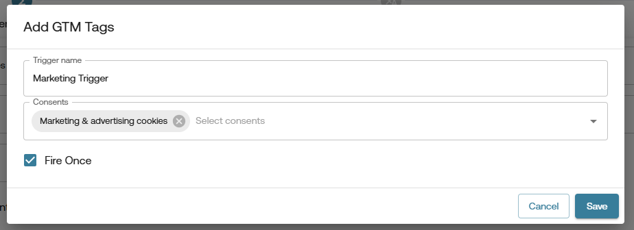
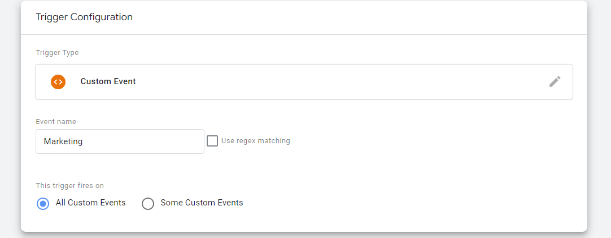
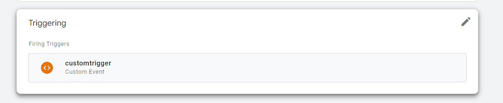

# How to fire GTM tags based on consents in CMP?

>Note: This Feature is only available in Gravito CMP (New) - Standard CMP Component.

In Gravito CMP (New) you can fire GTM tags based on the consents given by the user. This is done by configuring  the gtmTags field in Gravito CMP (New) config. The gtmTags field is an array of objects, where each object represents the Trigger events and its configurations which will be used to fire the GTM tags.

You can modify this field in either of the following ways:

1.  **Using Configurator**:  

    -   Open the CMP configurator in admin Portal.  
    -   Select the config from the list and click on the **Copy Configuration** icon/button.  
    -   This will create a new CMP config with the same settings as the original one. Now enter the name on the Basic Settings page and click the **Get Started** button.  
    -   In the left-side menu, select the **Standard CMP** component.  
    -   Now click on **Consent Categories** Tab.  
    -   In this tab, you will see the `gtmTags` sections. Click on Add GTM Tags button to add a new GTM tag configuration.It will open a modal which will have the following fields:  
        - **Trigger Name**: This is the event name which will be added to the data layer, and In GTM you can create a Custom Trigger using this event.  
        - **Consents**: In this multi-select control you can choose the cosnents item to which you want to bind this events, i.e value of this consent will decide wether to add the above events in the dataLayer object.
        - **Fire Once**: Check this checkbox if you want to fire the event only once in the session. In maximum cases you will need to keep this flag checked as you want your tag to fire once to avoid duplicate loading of tags.
        
    -   Once you have added the GTM tag configuration by clicking **Save**, you can see it in the list of GTM tags. You can add multiple GTM tags by clicking on the **Add GTM Tags** button again.
    - Click on the **Save Progress** button and then click on the **Publish** button to publish the new config.  
    -   Now when you will use this updated config in your website, it will fire GTM tags based on the consents given by the user.

   


2.  **Without Configurator**:

    -   if you are having Gravito CMP component in context then update the gtmTags field at `window.gravito.configcmp.tcf.core.gtmTags` in the config object.
    below code is an example of how the gtmTags field should look like:
    
```javascript
window.gravito = {
    config: {
        cmp: {
            standard: {
                core: {
                    gtmTags: [
                        {
                            triggerName: 'Marketing Consent update',
                            consents: [3],
                            fireOnce: true
                        },
                        {
                            triggerName: 'Analytics Consent update',
                            consents: [2],
                            fireOnce: true
                        }
                    ]
                }
            }
        }
    }
};
```
- Now when you will use this updated config in your website, it will fire GTM tags based on the consents given by the user.

   


## How this works Internally?

Whenever you have this field in your config , CMP will check the consent value of the consents ids you have provided in the gtmTags field. If the consent value is true then it will add the event to the dataLayer object. So for example if you have added the gtmTags field as shown above, then CMP will add the following event to the dataLayer object if the consent value of the consent id 3 is true:
```javascript
window.dataLayer.push({
    event: 'Marketing Consent update',

});
```
Now in GTM you can create a Custom Trigger using this event. So whenever the user gives consent to the consent id 3, this event will be added to the dataLayer object and you can use this event to fire your GTM tags.

## How to create a Custom Trigger in GTM?
1.  Open your GTM account and select the container where you want to create the trigger.
2.  Click on the **Triggers** tab in the left-side menu.
3.  Click on the **New** button to create a new trigger.
4.  In the trigger configuration, select **Custom Event** as the trigger type.
5.  In the **Event Name** field, enter the event name which you have provided in the gtmTags field in the config. For example, if you have provided `Marketing Consent update` as the event name, then enter it here.

6.  In the **This trigger fires on** section, select **All Custom Events** or **Some Custom Events** based on your requirement.
7. Now click on the **Save** button to save the trigger.
8.  Now you can use this trigger in your GTM tags to fire them based on the consents given by the user.



