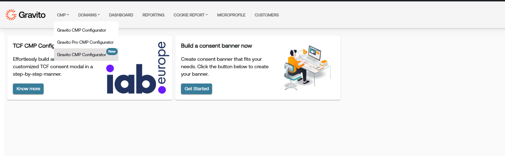
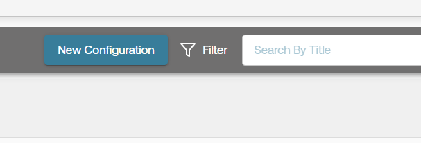
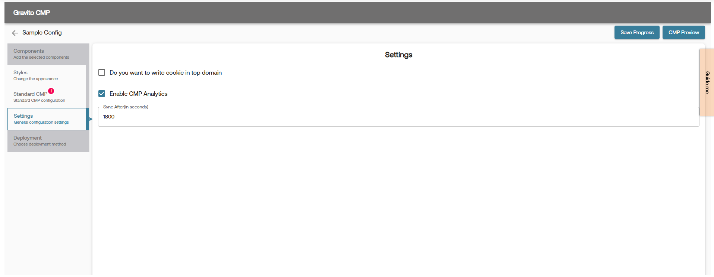
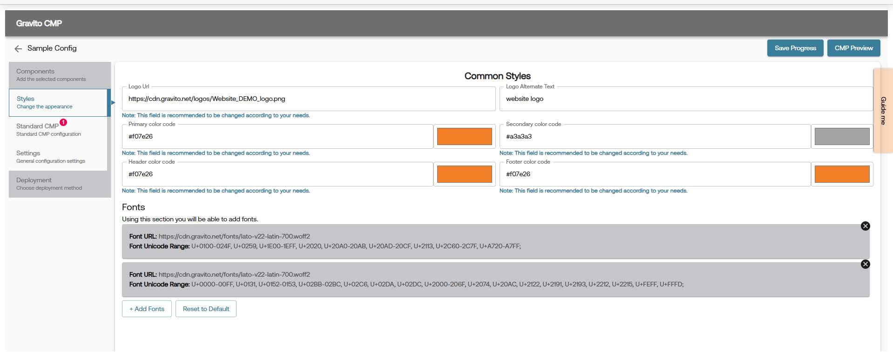
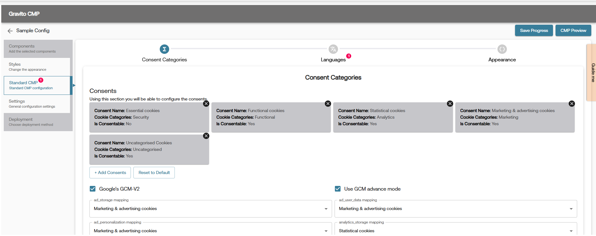

Gravito CMP (New) Setup can be done using Gravito CMP (New) Configurator on Gravito’s Admin Portal.

Go to CMP >> Gravito CMP (New)

Click on "New Configuration" button to create a new configuration.

Click on "Get Started" button after adding a Config name and selecting a appropriate framework.

You can now go through each of the following sections and configure the CMP as per your requirement.

### 1. Settings configuration Tab

### 2. Styles configuration Tab

### 3. Framework configuration Tab

### 4. Deployment Tab

> **Note**: If you want to check how a published CMP looks like, you can always click the publish option from the CMP configuration listing. This will take you to the deployment page. Here you can use the **CMP Preview** button.
