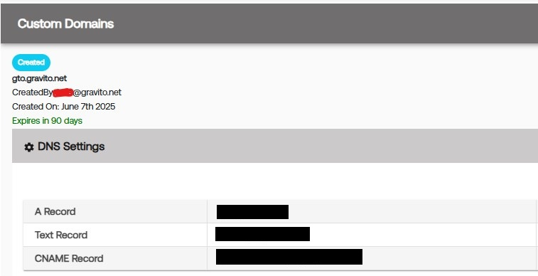
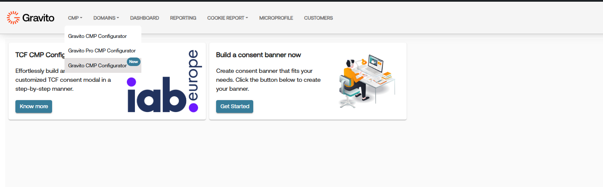
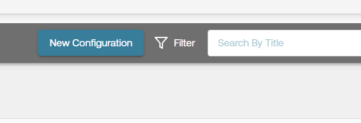
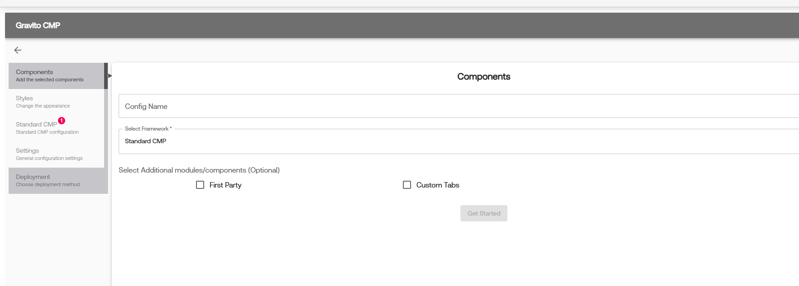
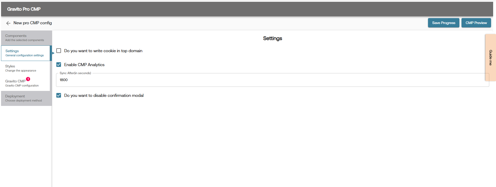
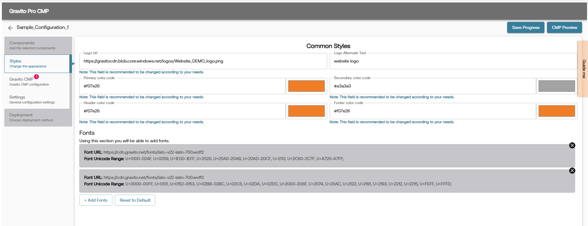
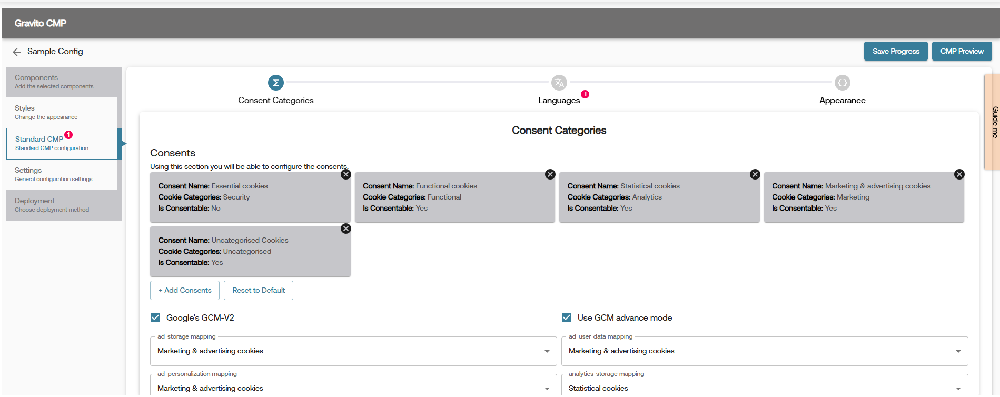
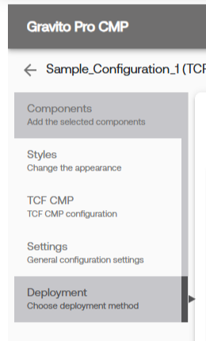

## Domain Setup and Validation
To get started with Gravito CMP, you first need to validate the ownership of the domain where you are going to deploy the CMP. For Gravito, First Party domain means the domain your website operates. e.g. website.com. To avoid third party cookies being blocked (occurs already on many browsers) you can configure the CMP to set the cookies under first party domain itself, giving the consent persistance under a first party server side cookie.

To get started with domain and first party setup, you first need to set up domain in [Gravito’s admin panel](https://adminv2.gravito.net)

### Step 1 : Setup 

**Setup of first party domain**

Once you have configured your domain gto.website.com, you need to do the DNS changes for your domain. These steps are varying between different DNS providers, generally you have to configure three records:
 
  

### Step 2 : Validation

**First party domain configuration**
After you have made the DNS records (A, TXT and CNAME), allow the changes to propagate to DNS servers (few minutes at least) and then press “Validate” button. After succesful validation you should see domain status as “Validated”:

## CMP Setup and Validation

Gravito CMP Setup can be done using Gravito CMP Configurator on Gravito’s Admin Portal. (Older versions of configurators are depracated, if you need help with any older version please contact Gravito Support)

Go to CMP >> Gravito CMP (New)

Click on "New Configuration" button to create a new configuration.

Click on "Get Started" button after adding a Config name and selecting a appropriate framework.

You can now go through each of the following sections and configure the CMP as per your requirement.

### 1. Settings configuration Tab

### 2. Styles configuration Tab

### 3. Framework configuration Tab

### 4. Deployment Tab

> **Note**: If you want to preview how your customized CMP banner looks, click the “CMP Preview” button in the top-right corner of the Configurator page. For more details, refer to the [CMP Preview document](./Components/preview.md).