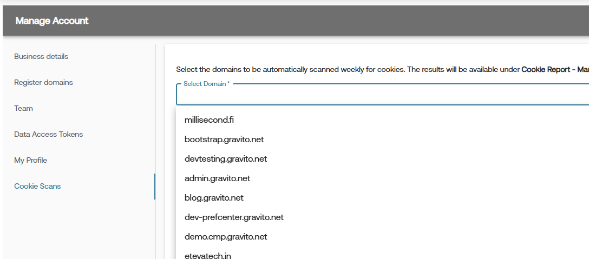
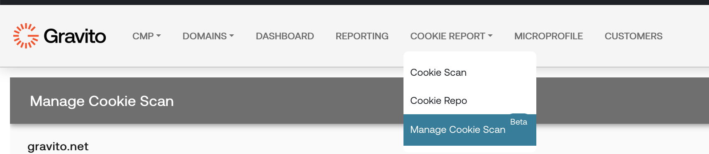
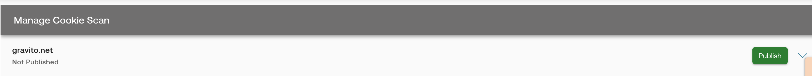
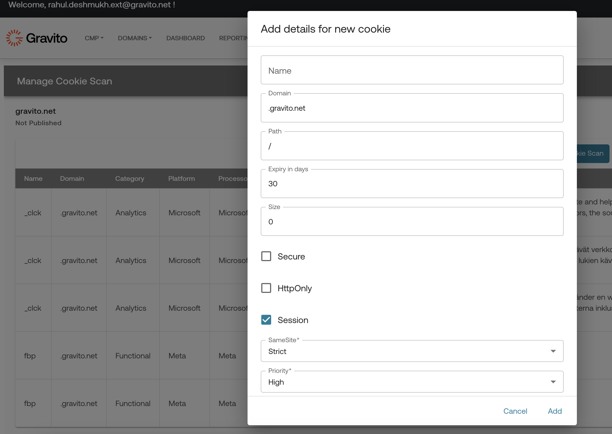
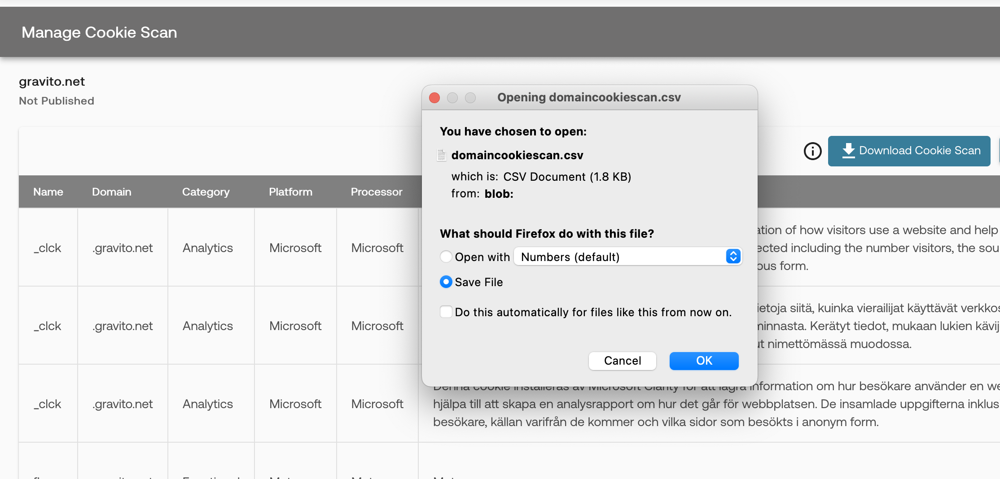
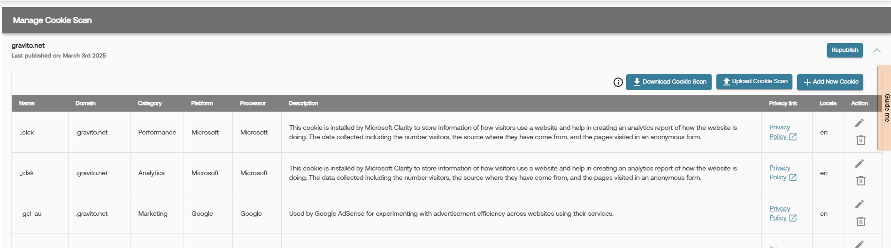
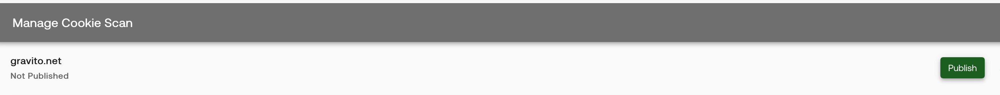

## Domain Cookie Scan

Gravito provides an automated way to scan your domains, where you wish to deploy Gravito's PRO CMP. 

You can follow the following steps to achieve this.

- Decide and choose domains you need to automatically scan under Accounts
- Once cookie scan become available, you can edit, upload more cookies, add locales and translations and publish.

### Lets get started.

To enable the automated scan for your domain, please access Gravito's admin portal and go to "Account" section. Use "Manage cookie scan" section. Add the domain for which you wish to enable automated scan. 

As you might be using various technologies on your site, at times it would be impossible for a automated scan to capture all possible cookies which are dropped. 

We provide an easier way for you to manage the cookie listing and publish the listing which will be used by the CMP banner.

Following sections outlines this functionality in detail. 

Access the Domain Cookie Scan feature in Gravito's admin portal

If the automated cookie scan was done for your domain, you will see a accordion already added for the domain.

Open the accordion and you will see a list of cookies found by the automated scan. If you want to add a new cookie to that list, please click on the "Add New Cookie" button, it will open a dialog, where you can add the required details.

If you wish to bulk update the cookies, then there is an easy way to do it, you can download the cookie listing, by clicking on "Download Cookie Scan", it will download all the cookies into a CSV file, which you can update. 

Please note that, Gravito support multilingual cookies based on your choice of languages. The CSV has a Locale field, please add your locale like "en" for English, "fi" for Finnish, "sv" for Swedish.  Please add the description into the relevant language.

Once you are done with your updates to the cookie listing in CSV, you can then upload it using the "Upload Cookie Scan" button. 

Finally, when you are happy with your cookie listing, you can choose to Publish the cookie scan report, using the "Publish" button. 

You can repeat this process, as many times as you wish, just make sure that you republish your changes, so that those will be seen on your CMP banner. 