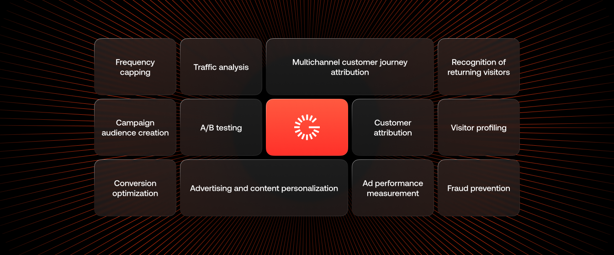

# Welcome to Gravito's Documentation pages

## We’re leading with privacy in visitor data solutions

<h1>Gravito Documentation</h1>

  Build, configure and troubleshoot Gravito products and integrations.

  <a class="docs-card" href="/Gravito_V6_CMP/Getting_Started/">
    
Gravito CMP

    

      Configure consent management, TCF, Google Consent Mode and CMP features.
    

    
Get started →

  </a>

  <a class="docs-card" href="/Gravito_SDK/Getting_Started/">
    
Gravito SDK

    

      Implement Gravito's client-side SDK and developer integrations.
    

    
View SDK docs →

  </a>

  <a class="docs-card" href="/Consent_Management/Iab_tcf/">
    
Consent Management

    

      Guides for IAB TCF, Google, Microsoft and Amazon consent integrations.
    

    
Explore →

  </a>

  <a class="docs-card" href="/Getting_started/Support">
    
Support

    

      Troubleshooting, support information and implementation help.
    

    
Get help →

  </a>

Our mission is to deliver flexible and purpose-built technology that can operate as a standalone solution or within your cloud environment.

Clients can choose tools to enhance their marketing capabilities, tailored to the maturity of their tech stack.

Looking for something else?    [Product Page](https://www.gravito.net) |    [Customer Portal](https://adminv2.gravito.net).

### Loved by developers and business
